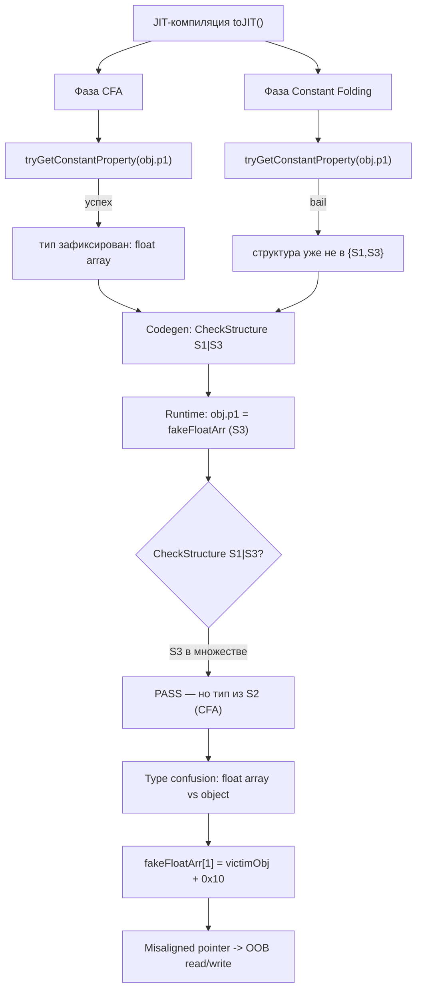

# CVE-2024-23222 — структурная карта (cassowary)

> WebKit DFG JIT — type confusion через race в `tryGetConstantProperty`
> (CFA vs Constant Folding). Использовался в Coruna (NSO) как WebKit-escape.

## 1. Идентификация

| Поле | Значение |
|------|----------|
| CVE | CVE-2024-23222 |
| Apple Advisory | HT207584 (Safari 17.3, 2024-03-07) |
| Bugzilla | 267134 |
| Patch commit | `6471469` / `66f60de` |
| Тип | Type confusion (CWE-843) |
| Компонент | WebKit / JavaScriptCore / DFG (Air) |
| CVSS (NVD) | 8.8 (High) |
| Эксплуатация | Coruna (NSO) — iOS < 17.3, Safari < 17.3 |
| Продукт | Safari, iOS, iPadOS, macOS (WebKit) |

## 2. Продукт / ветка

```
WebKit
└── Source/JavaScriptCore
    └── dfg/
        ├── DFGCFANode.cpp          <- tryGetConstantProperty (CFA)
        ├── DFGConstantFolding.cpp  <- tryGetConstantProperty (CF)
        └── DFGDriver.cpp           <- порядок фаз CFA -> CF
```

## 3. Схема уязвимости



## 4. Структурное дерево (S1 -> S2 -> S3)

```
S1: (p1, p2)   <- structS1 и structS3 стартуют здесь
 |
 |  delete p2 (RACE во время компиляции)
 v
S2: (p1)       <- промежуточная, НЕ watched
 |
 |  delete p1; p1=...; p2=...
 v
S3: (p1, p2)   <- финальная, watched (Leaf)

JIT видит множество структур {S1, S3} (training).
Watchpoints: S1, S3. Переход через S2 НЕ отслеживается.
```

## 5. Связь с iOS26 / iMessage RCE

```
iMessage (IMAgent)
  └── WebKit (WebKit2)
       └── JSC DFG JIT
            └── CVE-2024-23222 (cassowary)
                 └── type confusion
                      └── OOB read/write
                           └── RCE (Coruna: NSO)
```

- **iOS26 framework**: `ios26_imessage_rce.py` — кандидат WebKit-escape.
- **CVE-2024-23222** — основной кандидат (Coruna, 2024).
- **CVE-2025-31205 / CVE-2025-43300/43301** — альтернативные кандидаты (2025).

## 6. Патч (6471469)

```
До:  tryGetConstantProperty вызывается в CFA и CF независимо.
     Если структура изменилась между вызовами -> разный результат.
После: результат tryGetConstantProperty кэшируется / проверяется
     единообразно, race устранён.
```

## 7. Файлы исследования

| Файл | Назначение |
|------|-----------|
| `CVE-2024-23222_map.md` | Эта карта |
| `CVE-2024-23222_research.md` | Глубокое исследование + RCA |
| `cassowary_harness.js` | Harness на уязвимую версию |
| `cassowary_lldb_commands.txt` | LLDB breakpoint (прямое утверждение) |
| `run_cassowary_harness.sh` | N попыток (race window) |
| `ios26_imessage_rce.py` | iOS26 framework (кандидаты) |
| `ios26_imagent_hook.js` | Hook IMAgent |
| `ios26_webkit_hook.js` | Hook WebKit |
| `ios26_imessage_rce.md` | Документация iOS26 |
