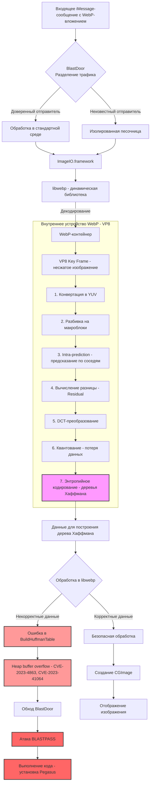
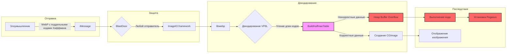

### 📘 Полный конспект: libwebp, уязвимости CVE-2023-4863/41064, архитектура Apple и фаззинг

---

## 1. Введение
- **libwebp** — библиотека Google для работы с форматом WebP.
- В экосистеме Apple (iOS, macOS) используется внутри **ImageIO.framework**.
- Версия **1.3.1** содержала **heap buffer overflow** (CVE-2023-4863 и CVE-2023-41064), исправленную в **1.3.2**.
- Уязвимость эксплуатируется через отправку специально сформированного WebP-изображения в **iMessage**, обходя защиту **BlastDoor** (атака **BLASTPASS**).

---

## 2. Общая архитектура обработки WebP в iMessage

### Диаграмма 1. Базовый поток (без деталей формата)

```mermaid
flowchart TD
    A[Пользовательское приложение: iMessage] -->|Отправка/получение WebP| B[Sandbox iMessage]
    B -->|Вызов системного API| C[ImageIO.framework]
    C -->|Использует| D[libwebp (динамическая библиотека)]
    
    D -->|Версия 1.3.1| E[Уязвимость heap buffer overflow]
    D -->|Версия 1.3.2| F[Исправленная версия]
    
    E -->|CVE-2023-4863| G[Ошибка при распаковке WebP]
    E -->|CVE-2023-41064 (BlastBass)| G
    
    G -->|Приводит к| H[Краш / выполнение кода]
    
    subgraph Платформы
        I[iOS] --> C
        J[macOS] --> C
        K[Android] -->|Использует собственную реализацию libwebp| L[Аналогичные уязвимости]
    end
    
    style E fill:#f9f,stroke:#333,stroke-width:2px
    style G fill:#f66,stroke:#333,stroke-width:2px
    style H fill:#f66,stroke:#333,stroke-width:2px
```

**Описание:**  
Показывает общий путь от iMessage до libwebp, зависимость от версии и последствия.

---

## 3. Детальная структурная связь с BlastDoor, внутренним устройством WebP и уязвимостью

### Диаграмма 2. Полный путь с разделением трафика, этапами декодирования и точкой эксплуатации



**Описание:**  
- **BlastDoor** разделяет трафик по доверенности, но оба потока идут через ImageIO.  
- **libwebp** декодирует WebP, проходя все этапы обратного сжатия (от контейнера до энтропийного кодирования).  
- На этапе построения дерева Хаффмана (шаг 7) возможна вставка некорректных данных, вызывающих ошибку в `BuildHuffmanTable`.  
- Это приводит к переполнению буфера, обходу BlastDoor и выполнению кода (Pegasus).  
- Исправленная версия (1.3.2) безопасно создаёт CGImage.

---

## 4. Детали сжатия WebP (VP8) и роль дерева Хаффмана

### Диаграмма 3. Этапы сжатия (конвертации) в WebP

```mermaid
flowchart TD
    A[Исходное изображение<br>JPEG/PNG] --> B[Конвертация в YUV<br>Цветовое пространство]
    B --> C[Разбивка на макроблоки]
    C --> D[Анализ соседей<br>Intra-prediction]
    D --> E[Вычисление разницы<br>Residual]
    E --> F[Дискретное<br>косинусное<br>преобразование (DCT)]
    F --> G[Квантование<br>Потеря данных]
    G --> H[Энтропийное<br>кодирование<br>(деревья Хаффмана)]
    H --> I[Готовый файл<br>WebP (VP8 key frame)]

    style G fill:#f9f,stroke:#333,stroke-width:2px
    style H fill:#f9f,stroke:#333,stroke-width:2px
```

**Описание:**  
Наглядно показывает, что **дерево Хаффмана** является последним этапом сжатия (и, соответственно, первым при декодировании). Ошибка в его построении – корень уязвимости.

---

## 5. Роль CGImage и связь с ImageIO

- **CGImage** – неизменяемый объект Core Graphics, содержащий пиксельные данные.  
- `UIImage`/`NSImage` – высокоуровневые обёртки.  
- Декодирование через libwebp завершается созданием CGImage – именно здесь обрабатываются опасные данные.  
- Хотя сам CGImage не уязвим, он является финальной точкой, где происходит распаковка, и может быть использован в атаке (например, для отображения вредоносного изображения).

---

## 6. Фаззинг-харнес для воспроизведения CVE-2023-4863

Для поиска и подтверждения уязвимости используется **libFuzzer**. Ниже представлен **полный код харнеса** с добавленной проверкой заголовков (оптимизация для фаззинга) и пояснениями.

```c
/* harness/fuzz_webp.c - libFuzzer harness for libwebp CVE-2023-4863
 *
 * Уязвимость: heap buffer overflow в BuildHuffmanTable() при декодировании
 * lossless WebP (VP8L). Ошибка возникает из-за некорректных длин кодов Хаффмана,
 * приводящих к записи за пределы выделенной таблицы.
 *
 * Харнес вызывает путь декодирования RGBA: WebPGetFeatures() -> WebPDecodeRGBAInto(),
 * который в свою очередь приводит к VP8LDecodeHeader -> ReadHuffmanCodes ->
 * VP8LBuildHuffmanTable.
 *
 * Для эффективного фаззинга требуется корпус реальных WebP-изображений или
 * специально подготовленный PoC, так как случайные данные редко проходят
 * валидацию формата.
 */

#include <stdio.h>
#include <stdlib.h>
#include <stdint.h>
#include <stddef.h>
#include <string.h>          // для memcmp
#include "webp/decode.h"

#ifdef __cplusplus
extern "C"
#endif
__attribute__((noinline))
int LLVMFuzzerTestOneInput(const uint8_t *data, size_t size) {
    // 1. Проверка размера
    if (size < 12 || size > 1024 * 1024)
        return 0;

    // 2. Проверка магических заголовков WebP (RIFF...WEBP)
    //    Это ускоряет фаззинг, отбрасывая заведомо невалидные данные.
    if (memcmp(data, "RIFF", 4) != 0 || memcmp(data + 8, "WEBP", 4) != 0)
        return 0;

    // 3. Извлечение характеристик битового потока
    WebPBitstreamFeatures features;
    if (WebPGetFeatures(data, size, &features) != VP8_STATUS_OK)
        return 0;

    // 4. Ограничение размеров во избежание OOM
    if (features.width <= 0 || features.height <= 0 ||
        features.width > 1024 || features.height > 1024)
        return 0;

    // 5. Выделение буфера под RGBA-пиксели
    size_t out_buf_size = (size_t)features.width * features.height * 4;
    uint8_t *out_buf = (uint8_t *)malloc(out_buf_size);
    if (!out_buf)
        return 0;

    // 6. Декодирование (здесь может произойти переполнение)
    WebPDecodeRGBAInto(data, size, out_buf, out_buf_size, features.width * 4);

    // 7. Освобождение ресурсов
    free(out_buf);

    return 0;
}
```

**Ключевые моменты:**
- `memcmp` проверяет сигнатуру `RIFF....WEBP` – это критично для производительности фаззинга.
- Харнес целенаправленно идёт по пути RGBA, который ведёт к уязвимому коду.
- Используются ограничения размеров, чтобы избежать переполнения памяти.

---

## 7. Объединённая структурная схема всех связей

Для полноты восприятия ниже представлена **сводная диаграмма**, объединяющая все ранее описанные компоненты в одну целостную картину (без дублирования внутренних этапов, но с акцентом на ключевые точки).



---

## 8. Итоговые выводы и рекомендации

- **Обновление до libwebp 1.3.2** (и выше) полностью устраняет уязвимости.
- Apple выпустила исправления в **iOS 16.7, 17.0.1, macOS 13.6, 14.0**.
- **BlastDoor** не является абсолютной защитой – она может быть обойдена при наличии уязвимости в декодере.
- Для исследователей безопасности фаззинг с использованием представленного харнеса и корпуса реальных WebP-файлов позволяет находить подобные баги.
- Важно понимать внутреннее устройство формата (VP8, дерево Хаффмана) для эффективного поиска и анализа уязвимостей.

---
