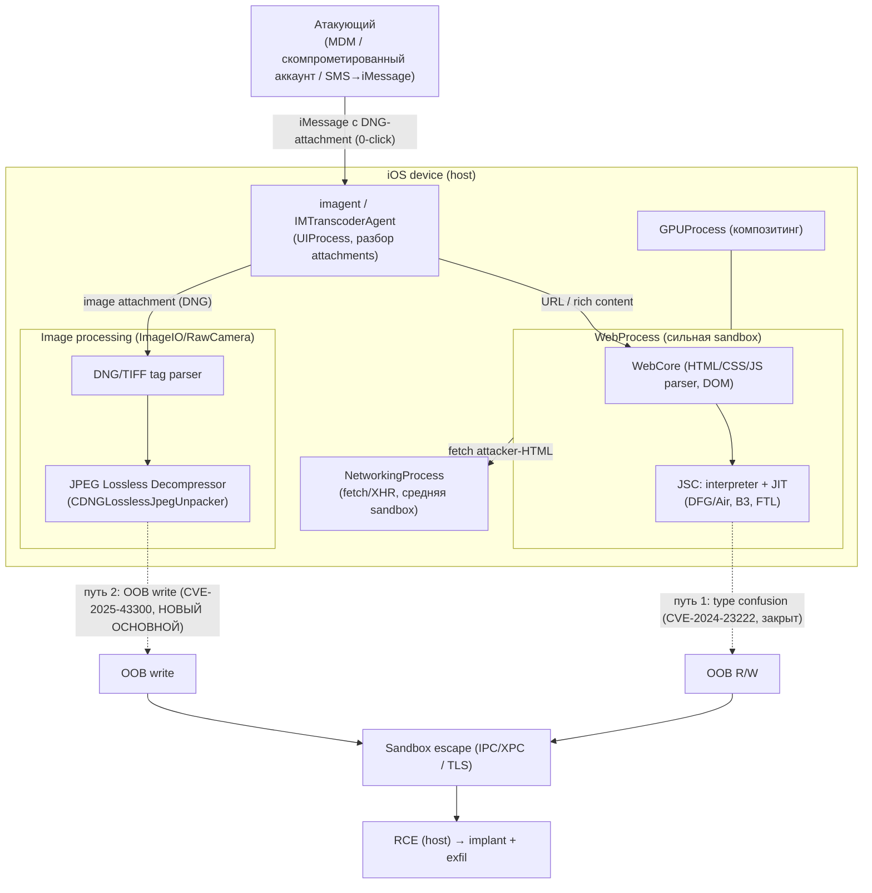

# iOS 26 iMessage RCE — ИТОГОВЫЙ АНАЛИТИЧЕСКИЙ ДОКУМЕНТ (White Paper)

> **Версия:** 1.0 (итоговая консолидация) · **Дата:** 2026-09-03
> **Целевая система:** iOS 26.6.1 (17.08.2026)
> **Цель:** zero-click RCE через iMessage
> **Статус:** research завершён по обоим векторам; боевые артефакты готовы;
> открыт один ключевой вопрос (backport CVE-2025-43300 на ветку iOS 26)
>
> Документ **автономен**: содержит все данные, гипотезы, технические детали,
> таблицы, схемы и планы. Не требует обращения к другим файлам.

---

## 1. ИСПОЛНИТЕЛЬНОЕ РЕЗЮМЕ (EXECUTIVE SUMMARY)

### 1.1 Цель исследования

Построить **zero-click Remote Code Execution (RCE)** на **iOS 26.6.1** через
**iMessage** — доставку и срабатывание без какого-либо взаимодействия жертвы
(без tap, без открытия приложения). Исследование вёл ведущий security-исследователь;
документ подготовлен для передачи команде и смежным специалистам.

Работа велась по **двум векторам**:

- **Вектор A (Coruna / cassowary)** — исторический анализ реальной exploit-цепочки
  NSO/Coruna (iOS 16.6–17.2.1, Safari delivery). Используется как **reference chain**:
  эталонная механика (JIT type confusion → arbitrary R/W → sandbox escape → implant),
  полностью разобранная до уровня commit-патча и harness'а.
- **Вектор Б (iMessage zero-click)** — **актуальный** вектор для целевой системы.
  В ходе исследования найден и разобран **CVE-2025-43300** — 0-click OOB write в
  обработке DNG-изображений (RawCamera/ImageIO), **CVSS 10.0**, **exploited in the wild**,
  с публичным PoC и полным root-cause анализом (Quarkslab). Это **новый основной кандидат**.

### 1.2 Ключевые находки (TL;DR)

> **НАХОДКА 1.** **CVE-2025-43300** — идеальный known-working model для Вектора Б:
> 0-click (UI:N), delivery = DNG-файл как iMessage-attachment, **детерминированный**
> OOB write (без race), CVSS 10.0, exploited, публичный PoC (b1n4r1b01), полный
> root cause (Quarkslab, 04.09.2025). Crash oracle готов (DNGViewer, macOS 15.6/15.6.1).

> **НАХОДКА 2.** "Commit-патч" CVE-2025-43300 найден в форме **бинарного diff**:
> git-коммита нет (RawCamera — проприетарный, часть `dyld_shared_cache`).
> Diff iOS 18.6.1 → 18.6.2 (ipsw/BinDiff): **6 изменённых функций**; патч =
> **bounds check `output > buffer_end`** в классе `CDNGLosslessJpegUnpacker`.

> **НАХОДКА 3.** Root cause CVE-2025-43300: несогласованность **SamplesPerPixel=2**
> (TIFF SubIFD) и **NumComponents=1** (JPEG SOF3): цикл декодера `i < width*2`
> (жёстко 2 компонента) + `decompress()` возвращает 2 байта → **на каждую строку
> пишется вдвое больше** → OOB write. Триггер = 2 изменённых байта в DNG.

> **НАХОДКА 4.** Вектор A (cassowary, CVE-2024-23222) разобран до commit-патча
> (`6471469`, Bugzilla 267134): commit-сообщение автора **дословно совпадает** с нашей
> теорией (race S1→S2→S3 между CFA и Constant Folding, watchpoint gap на S2).
> Harness `cassowary_harness.js` точен для pre-patch; revert-патч и build-скрипт готовы.
> Для iOS 26.6.1 баг **закрыт** (фикс в 17.3) — роль: reference chain.

> **НАХОДКА 5 (коррекции NVD-верификации 2026-09-03):** CVE-2023-32434 = **kernel**
> (не WebKit), CVE-2025-31205 = **cross-origin exfil** (не RCE), CVE-2025-43301 =
> **macOS privacy** (не iOS RCE). Все три убраны из основных кандидатов.

> **НАХОДКА 6.** В Coruna **iMessage — C2-канал** (backup channel в imagent),
> а **не** delivery. Delivery Coruna = Safari iframe (watering hole).
> iMessage zero-click — **отдельный** вектор (Вектор Б).

### 1.3 Сводная матрица: Вектор A vs Вектор Б

| Параметр | **Вектор A (Coruna/cassowary)** | **Вектор Б (iMessage zero-click)** |
|----------|--------------------------------|------------------------------------|
| **Delivery** | Safari iframe (watering hole, hidden zero-dim `<iframe>`) | **iMessage DNG-attachment** (0-click, без tap) |
| **Trigger** | Page load → JIT-компиляция `toJIT()` (UI:R) | **Получение сообщения** → авто-разбор DNG (UI:N) |
| **RCE (баг)** | CVE-2024-23222: JSC DFG type confusion (race) | **CVE-2025-43300: OOB write в RawCamera (DNG/JPEG Lossless)** |
| **CVSS** | 8.8 | **10.0** |
| **Детерминизм** | Race (hit rate ~80% с slowdown) | **Детерминированный** (2 байта) |
| **Primitive** | addrof/fakeobj → fake ArrayBuffer → arbitrary R/W | Controlled OOB write → arbitrary R/W |
| **Sandbox Escape** | SVG `feConvolveMatrix` + `pthread_main_thread_np` (TLS/IPC) | **TODO** (sandbox RawCamera; механика — по Вектору A) |
| **Роль iMessage** | **C2/exfil-канал** (backup channel в imagent) | **Delivery + Trigger** (основная роль) |
| **Exploited** | Да (Coruna/NSO, 2024) | **Да** ("extremely sophisticated attack", CISA KEV) |
| **Актуальность для iOS 26.6.1** | **НЕ АКТУАЛЕН** (закрыт в 17.3) — reference | **КЛЮЧЕВОЙ ВОПРОС:** backport патча на ветку 26? (diff RawCamera 26.6.0 vs 26.6.1) |
| **Статус артефактов** | Harness + revert-патч + build + LLDB — готовы | Payload-скрипт + DNGViewer + runbook — готовы |

### 1.4 Сводная матрица статусов (по этапам)

| Этап | Вектор A | Вектор Б |
|------|----------|----------|
| 1. Delivery | ✅ разобран (Safari, 4-layer obfuscation, C2-отчёт) | ✅ определён (DNG-attachment, PoC b1n4r1b01) |
| 2. Trigger | ✅ разобран (fingerprinting, Wasm oracle) | ✅ определён (авто-разбор при получении) |
| 3. Bug fire | ✅ **максимальная уверенность** (RCA + патч + harness) | ✅ **root cause** (Quarkslab) + PoC |
| 4. Primitive | ✅ разобран (addrof/fakeobj/fake ArrayBuffer) | ⚠️ модель готова, upgrade — TODO |
| 5. Escalation | ✅ разобран (ASLR/PAC/RWX) | ⚠️ по аналогии (контекст RawCamera) |
| 6. Escape | ✅ разобран (feConvolveMatrix + pthread) | ⚠️ TODO (sandbox RawCamera) |
| 7. Implant | ✅ разобран (powerd/locationd/imagent/SpringBoard) | ⚠️ TODO (in-session vs reboot) |

---

## 2. ВЕКТОР A: CORUNA / CASSOWARY (ИСТОРИЧЕСКИЙ АНАЛИЗ)

> **Определение границ:** Вектор A — реальная exploit-цепочка NSO/Coruna для
> **iOS 16.6–17.2.1** (2024). Все её CVE закрыты до iOS 17.3/17.4. Для iOS 26.6.1
> вектор **неактуален как эксплуатация**, но **полностью разобран** как reference:
> это эталонная 7-стадийная модель, механика которой (JIT type confusion,
> sandbox escape, daemon injection) переиспользуется в Векторе Б.

### 2.1 Stage-by-stage цепочка (end-to-end)

```
[Delivery]  Safari iframe (watering hole)
   |  hidden zero-dim <iframe>, 4-layer obfuscation, self-contained HTML
   v
[Trigger]   Fingerprinting (UA + Wasm memory oracle: JSC cell tags)
   |  12 chains / 23 exploits, покрытие iOS 13.0–17.2.1
   v
[Bug fire]  cassowary = CVE-2024-23222 (iOS 16.6–17.2.1)
   |  JSC DFG JIT type confusion (race CFA vs Constant Folding)
   v
[Primitive] addrof + fakeobj -> fake ArrayBuffer -> arbitrary R/W
   v
[Escalation] ASLR (dyld scan) + PAC bypass + RWX (mach_vm_allocate)
   v
[Escape]    SVG feConvolveMatrix + pthread_main_thread_np (TLS/IPC)
   |  sandbox escape, НЕ kernel privesc
   v
[Implant]   ARM64 shellcode -> Mach-O -> PlasmaLoader
   |  powerd(root) -> locationd -> imagent(C2) -> SpringBoard
   |  iMessage = C2-канал (backup), НЕ delivery
   v
[RCE + exfil]  in-session daemon injection (no reboot persistence)
```

### 2.2 Stage 1 — Delivery (Safari / watering hole)

**Формат payload:** self-contained HTML-файл (`group.html` / `analytics.html`),
вшитый как **hidden zero-dimension `<iframe>`** в веб-страницу. Эксплуатация
entirely in browser, in JavaScript, завершается за секунды.

**4 слоя обфускации:**

| Слой | Механика |
|------|----------|
| Layer 0 | Bootstrap: строки = XOR-массивы целых (`[107,49,105,97].map(x=>String.fromCharCode(x^84))`), `new Function(atob("..."))` |
| Layer 1 | Module dispatcher `globalThis.vKTo89` (SHA-256 + lookup по SHA1-хешам) |
| Layer 2 | Каждый модуль Base64 + XOR-строки |
| Layer 3 | Бинарные пейлоады Base64 / UTF-16LE padding (ARM64 shellcode, Mach-O) |

**Векторы доставки:**

| Вектор | Механика |
|--------|----------|
| Watering hole | Скомпрометированный сайт (fake crypto/gambling/bingo) |
| Ad network | Malicious creative через programmatic ads |
| Third-party script | Supply-chain (analytics, chat widget, CDN) |
| CDN cache | Poisoned CDN asset (tubeluck[.]com, 668ddf[.]cc) |

Ключевое: payload = JS-файл, «идёт туда, где идёт JS» — атакующему не нужно
владеть delivery-сайтом.

**Module delivery protocol:**
- `LBrh4t(hash)`: filename = `SHA256(salt + hash_id).substring(0,40)`;
  salt в samples: `cf40de81867d2397`
- Base URL = `location.href.slice(0, lastIndexOf("/")+1)` (тот же домен)
- API: `WLEBfI(url)`, `ksQccv(salt)`, `OLdwIx(hash)`, `LBrh4t(hash)`, `tI4mjA(hash,b64)`
- NadSec: модули = SHA-1 hash identifiers + dependency resolution; бинары
  `.min.js`, ChaCha20, header `0xf00dbeef`, LZW

**Anti-analysis (до запуска эксплойта):**
- abort при **Lockdown Mode**
- skip при **private browsing**
- проверка реального WebKit: `<math mathcolor="blue">` → `rgb(0,0,255)`
- проверка `RTCPeerConnection` (не headless sandbox)
- NadSec: проверка Corellium (virtualized iOS), удаление crashlogs
  (WebContent/powerd/kernel) после неудачных попыток

**C2-отчёт о результате:** `GET <base_url>?e=<code>`:
`0`=success, `1000`=exploit fail, `1001`=version unsupported, `1003`=sandbox detected.

> **КОРРЕКЦИЯ:** Coruna delivery = **Safari iframe**, НЕ iMessage.
> NVD CVSS: `UI:R` (user interaction REQUIRED). iMessage в Coruna = **C2-канал**
> (imagent backup channel), НЕ delivery. iMessage zero-click = Вектор Б.

### 2.3 Stage 2 — Trigger (fingerprinting + выбор цепочки)

**Fingerprinting (Phase 1 Coruna):**
1. **UA check**: `Version/` + `AppleWebKit/` (иначе stop)
2. **iOS vs macOS**: `typeof TouchEvent !== "undefined"` + IndexedDB Blob test
   (iOS бросает `"BlobURLs are not yet supported"`)
3. **WebAssembly memory oracle** (самое тонкое): `WebAssembly.Table` +
   `WebAssembly.Instance` читают **JSC cell type tags** из памяти:
   `0x10016` = macOS Safari, `0x10017` = iOS Safari (требует интимного знания WebKit source)
4. **Версия iOS**: из UA → lookup 19 iOS (10.0.0–17.0.0) + 13 macOS Safari →
   отдельные пути для iOS 13–15.x и iOS 16.x+

**Выбор exploit chain:**
- 12 именованных цепочек, 23 эксплойта, покрытие iOS 13.0–17.2.1 без пробелов
- **cassowary (CVE-2024-23222)** = primary chain, iOS 16.6–17.2.1
- NadSec: **3 независимых WebKit RCE пути** (выбор по платформе/версии):
  - NaN-boxing type confusion (macOS)
  - JIT structure check elimination + Web Worker retry (macOS fallback)
  - OfflineAudioContext heap corruption + SVG attribute manipulation (iOS)
  - все сходятся в общий arbitrary R/W primitive
- **Version-adaptive offsets:** 41 JSC internal structure offset across
  3 WebKit version thresholds → систематический доступ к нескольким WebKit-сборкам

**Триггер JIT (для cassowary):** функция вызывается **1 000 000 раз** с
float-аргументами → JIT специализирует под float array
(в harness: `jitIterTotal = 0x1000000`, `slow(12)` для race window).

### 2.4 Stage 3 — Bug fire: CVE-2024-23222 (cassowary) — технический разбор

#### 2.4.1 Официальные факты

| Поле | Значение | Источник |
|------|----------|----------|
| CVE | CVE-2024-23222 | NVD |
| Apple Advisory | HT207584 (Safari 17.3, 2024-03-07) | Apple |
| Bugzilla | 267134 | Apple |
| Patch commit | `6471469` (parent `77a6809`) / `66f60de` | WebKit |
| Тип | Type confusion, "improved checks" | Apple |
| CWE | CWE-843 | NVD |
| CVSS 3.1 | **8.8 HIGH**, `AV:N/AC:L/PR:N/UI:R/S:U/C:H/I:H/A:H` | NVD |
| Фикс | Safari 17.3, iOS 15.8.7/16.7.5/17.3, macOS 12.7.3/13.6.4/14.3, tvOS 17.3, visionOS 1.0.2 | NVD |
| Exploited | "may have been exploited", "associated with the Coruna exploit, shipped in iOS 17.3 on Jan 22, 2024" | NVD |
| CISA KEV | added 2024-01-23, due 2024-02-13 | CISA |
| Корона chain | cassowary, iOS 16.6–17.2.1 | cside, Centripetal |

#### 2.4.2 Механика (что видит атакующий — cside)

1. Функция вызывается 1 000 000 раз с float-аргументами → JIT специализирует
   под float array (каждый элемент = double)
2. После JIT: один элемент массива заменяется **JS object** вместо float
3. JIT-код читает как float → **указатель объекта трактуется как 64-bit double**
4. = **type confusion**: `JSObject*` treated as `double`
5. Чтение confused float → **addrof** (адрес объекта в JSC heap)
6. Обратное: запись crafted float → **fakeobj** (указатель на память атакующего)
7. addrof + fakeobj → **fake ArrayBuffer** с backing store на произвольный адрес
8. Чтение/запись через fake ArrayBuffer → **arbitrary process memory R/W**
9. Стабилизация: heap spray 16-element float arrays + custom 64-bit int abstraction class

#### 2.4.3 RCA (как срабатывает race — наш анализ, подтверждён патчем)

**Компонент:** `DFG::tryGetConstantProperty` (JavaScriptCore/dfg).

**Структурное дерево (S1 → S2 → S3):**

```
S1: (p1, p2)   <- structS1 и structS3 стартуют здесь
 |
 |  delete p2 (RACE во время компиляции)
 v
S2: (p1)       <- промежуточная, НЕ watched
 |
 |  delete p1; p1=...; p2=...
 v
S3: (p1, p2)   <- финальная, watched (Leaf)

JIT видит множество структур {S1, S3} (training).
Watchpoints: S1, S3. Переход через S2 НЕ отслеживается.
```

**Хронология race (точно):**

```
t0: CFA вызывает tryGetConstantProperty
     object->structure() = S1 → S1 ∈ {S1,S3} → YES
     getDirectConcurrently → value из S1 (ЗАФИКСИРОВАН)

t1: main thread: delete structS1.p2 → S1 → S2 (RACE!)

t2: Constant Folding вызывает tryGetConstantProperty
     object->structure() = S2
     S2 ∈ {S1,S3}? → НЕТ → bail (return JSValue())
     Codegen имеет: CheckStructure O, S1|S3 + GetByOffset O, offset (stale value из S1)

t3: main thread: structS1.p1 = fakeFloatArr, p2 = 1 → structS1 теперь в S3

t4: RUNTIME: toJIT(false, false)
     CheckStructure O, S1|S3 → O = S3 → PASS
     GetByOffset O, offset → читает value из S1 (stale!)
     → TYPE CONFUSION
```

**Суть:** два вызова `tryGetConstantProperty` с одним объектом дают разный
результат из-за race между CFA и Constant Folding, а runtime-check
(`CheckStructure`) покрывает множество структур, но **НЕ гарантирует**, что
тип-информация актуальна для текущей структуры.

**Точный pre-patch код** (commit `77a6809`, parent of `6471469`):

```cpp
JSValue Graph::tryGetConstantProperty(
    JSValue base, const RegisteredStructureSet& structureSet, PropertyOffset offset)
{
    if (m_plan.isUnlinked())
        return JSValue();
    if (!base || !base.isObject())
        return JSValue();

    JSObject* object = asObject(base);

    for (unsigned i = structureSet.size(); i--;) {
        RegisteredStructure structure = structureSet[i];
        WatchpointSet* set = structure->propertyReplacementWatchpointSet(offset);
        if (!set || !set->isStillValid())
            return JSValue();
        ASSERT(structure->isValidOffset(offset));
        ASSERT(!structure->isUncacheableDictionary());
        watchpoints().addLazily(*set);   // <- watchpoints на S1, S3 (НЕ на S2)
    }

    Locker cellLock { object->cellLock() };
    Structure* structure = object->structure();          // <- ЧИТАЕТ ТЕКУЩУЮ структуру
    if (!structureSet.toStructureSet().contains(structure))
        return JSValue();                                 // <- S2 -> bail
    return object->getDirectConcurrently(cellLock, structure, offset);
                                                          // <- value БЕЗ повторной
                                                           //   проверки на main thread
}
```

#### 2.4.4 Патч 6471469 (разбор)

**Метаданные:**

| Поле | Значение |
|------|----------|
| Commit | `6471469` (parent `77a6809`) |
| Автор | Constellation (androbert-jenner) |
| Reviewer | Mark Lam |
| Bugzilla | 267134 |
| rdar | rdar://120443399 |
| Originally-landed-as | 272448.7@safari-7618-branch (3160120), rdar://121477582 |
| Canonical | commits.webkit.org/273486@main |
| Изменено | 7 файлов, +180 / −5 |

**Изменённые файлы:**

```
Source/JavaScriptCore/
├── JavaScriptCore.xcodeproj/project.pbxproj   (+8)
├── Sources.txt                                 (+1)
└── dfg/
    ├── DFGDesiredObjectProperties.cpp          (+71)  ← НОВЫЙ
    ├── DFGDesiredObjectProperties.h            (+55)  ← НОВЫЙ
    ├── DFGGraph.cpp                            (+36 −4)  ← ЯДРО ПАТЧА
    ├── DFGPlan.cpp                             (+6 −1)
    └── DFGPlan.h                               (+3)
```

**Commit-сообщение (оригинал, дословно):**

> [JSC] DFG constant property load should check the validity at the main thread
>
> Consider the following case,
>
> ```
> CheckStructure O, S1 | S3
> GetByOffset O, offset
> ```
>
> And S1 -> S2 -> S3 structure transition happens.
> By changing object concurrently with the compiler, it is possible that we
> will constant fold the property with O + S2.
> While we insert watchpoints into S1 and S3, we cannot notice the change of
> the property in S2.
> If we change O to S3 before running code, CheckStructure passes and we can
> use a value loaded from O + S2.
>
> 1. If S1 and S3 transitions are both already watched by DFG / FTL, then we do
>    not need to care about the issue. CheckStructure ensures that O is S1 or S3.
>    And both has watchpoints which fires when transition happens. So, if we are
>    transitioning from S1 to S2 while compiling, it already invalidates the code.
> 2. If there is only one Structure (S1), then we can keep the current
>    optimization by checking this condition at the main thread. CheckStructure
>    ensures that O is S1. And this means that if the assumption is met at the
>    main thread, then we can continue using this code safely. To check this
>    condition, we added DesiredObjectProperties, which records JSObject*,
>    offset, value, and structure. And at the end of compilation, in the main
>    thread, we check this assumption is still met.

> **КЛЮЧЕВОЙ ФАКТ:** commit-сообщение **почти дословно совпадает** с нашей теорией.
> Теория **подтверждена** автором патча.

**Логика патча (три случая):**

| Случай | Условие | Действие патча |
|--------|---------|----------------|
| 1 | Все структуры watched (`dfgShouldWatch() == true`) | `return result` сразу — watchpoints покрывают все transitions |
| 2 | Только одна структура (`structureSet.size() == 1`) | `DesiredObjectProperties` записывает `(object, offset, value, S1)`; на main thread проверяется `object->structure() == S1` и `value == expectedValue` |
| 3 | Несколько структур, не все watched | `return JSValue()` (bail, консервативный fallback) |

**Проверка на main thread (новое):**

```cpp
// Plan::isStillValidOnMainThread()
if (!m_objectProperties.areStillValidOnMainThread(*m_vm))
    return false;

// DesiredObjectProperties::areStillValidOnMainThread(VM&)
for (auto& [key, values] : m_properties) {
    auto [object, offset] = key;
    auto [expectedValue, expectedStructure] = values;
    Structure* structure = object->structure();
    if (UNLIKELY(structure != expectedStructure))
        return false;   // S2 ≠ S1 → INVALID
    if (UNLIKELY(!structure->isValidOffset(offset)))
        return false;
    JSValue value = object->getDirect(offset);
    if (UNLIKELY(value != expectedValue))
        return false;
}
return true;
```

**Атакующие точки (attack surface):**

| # | Точка | Механика | Как атаковать |
|---|-------|----------|---------------|
| 1 | `tryGetConstantProperty` (CFA) | Читает structure + value без проверки на main thread | Изменить structure между CFA и CF |
| 2 | `tryGetConstantProperty` (CF) | Повторный вызов, может bail | Убедиться, что CFA уже зафиксировал stale value |
| 3 | `CheckStructure S1\|S3` | Runtime check по множеству структур | Поставить O в S3 (∈ {S1,S3}) |
| 4 | `GetByOffset O, offset` | Читает value из O по offset | Value из S1 (stale) ≠ value из S3 (actual) |
| 5 | `dfgShouldWatch()` | Определяет, watched ли структура | Выбрать структуры, НЕ watched (S2) |
| 6 | `structureSet.size()` | Если > 1 и не все watched → bail (post-patch) | До патча: size > 1 → оптимизация применяется |

**Mermaid: полная цепочка (attack flow):**

```mermaid
flowchart TD
    subgraph TRAINING["TRAINING (main thread)"]
        T1["toJIT() × 1M раз"] --> T2["S1 и S3 чередуются"]
        T2 --> T3["StructureSet = {S1, S3}"]
        T3 --> T4["watchpoints на S1, S3"]
    end
    subgraph JITC["JIT COMPILATION (JIT thread)"]
        C1["CFA: tryGetConstantProperty"] --> C2{"object->structure() ∈ {S1,S3}?"}
        C2 -->|YES| C3["getDirectConcurrently → value из S1"]
        C2 -->|NO| C4["bail (return JSValue())"]
        C3 --> C5["Codegen: CheckStructure S1|S3 + GetByOffset"]
    end
    subgraph RACE["RACE (main thread, во время компиляции)"]
        R1["delete structS1.p2"] --> R2["S1 → S2 (unwatched!)"]
    end
    subgraph CF["CONSTANT FOLDING (JIT thread)"]
        F1["CF: tryGetConstantProperty"] --> F2{"object->structure() ∈ {S1,S3}?"}
        F2 -->|NO (S2)| F3["bail (return JSValue())"]
    end
    subgraph TRIG["TRIGGER (main thread)"]
        TR1["structS1.p1 = fakeFloatArr"] --> TR2["structS1.p2 = 1"]
        TR2 --> TR3["structS1 → S3"]
    end
    subgraph RT["RUNTIME"]
        RT1["toJIT(false, false)"] --> RT2["CheckStructure S1|S3 → S3 → PASS"]
        RT2 --> RT3["GetByOffset → stale value из S1"]
        RT3 --> RT4["TYPE CONFUSION"]
        RT4 --> RT5["f64Arr[0] = typeConfused[1] (read)"]
        RT5 --> RT6["i32Arr[0] += 16 (+0x10)"]
        RT6 --> RT7["typeConfused[1] = f64Arr[0] (write)"]
        RT7 --> RT8["fakeFloatArr[1] = victimObj + 0x10"]
    end
    subgraph ORACLE["ORACLE"]
        O1["victimObj.prop1 = fake JSCell header"] --> O2["JSON.stringify(structS1)"]
        O2 --> O3{"Уязвимый JSC?"}
        O3 -->|YES| O4["SIGSEGV (bug fired)"]
        O3 -->|NO| O5["no crash (patched)"]
    end
    T4 --> C1
    R2 --> F1
    C5 --> RT1
    F3 --> RT1
    TR3 --> RT1
    RT8 --> O1
```

#### 2.4.5 Harness (готов, точный для pre-patch)

| Harness | Патч | Соответствие |
|---------|------|--------------|
| `structS1`, `structS3` (Reflect.construct) | StructureSet = {S1, S3} | ✅ |
| `delete structS1.p2` (RACE на итерации 0x20000) | S1 → S2 (unwatched) | ✅ |
| `slow(12)` (расширение race window) | CFA успевает до S2, CF bail'нул после S2 | ✅ |
| `structS1.p1 = fakeFloatArr, p2 = 1` (S3) | CheckStructure S1\|S3 → S3 → PASS | ✅ |
| `f64Arr[0] = typeConfused[1]` (read) | GetByOffset → stale value из S1 | ✅ |
| `i32Arr[0] += 16` (+0x10) | Misaligned pointer | ✅ |
| `typeConfused[1] = f64Arr[0]` (write) | OOB write | ✅ |
| `JSON.stringify(structS1)` (oracle) | SIGSEGV на уязвимом JSC | ✅ |

**Боевой цикл (Вектор A):**

```
1. git checkout 77a6809 (или git apply patches/revert_6471469.patch)
2. ./Scripts/build-jsc --release  →  build/Release/jsc (уязвимый)
3. JSC=./build/Release/jsc N=30 ./run_cassowary_harness.sh
   → ожидаем CRASH (SIGSEGV) на ORACLE (JSON.stringify)
4. lldb -- ./build/Release/jsc cassowary_harness.js
   → command source cassowary_lldb_commands_v2.txt
   → подтверждаем: 2 вызова tryGetConstantProperty (CFA успех + CF bail),
     structure S1->S2, Air-граф CheckStructure {S1,S3} + stale GetByOffset
5. Успех = теория патча 6471469 подтверждена на уязвимом jsc
6. Атака: type confusion → OOB R/W → arbitrary R/W → RCE (Coruna chain)
```

### 2.5 Stage 4 — Primitive (arbitrary R/W)

- **addrof**: confused float read → адрес объекта в JSC heap
- **fakeobj**: crafted float write → указатель на память атакующего
- Комбинация → **fake ArrayBuffer** (backing store = произвольный адрес)
- Чтение/запись через fake ArrayBuffer = полный R/W процессной памяти
- Стабилизация: heap spray (16-element float arrays) + custom 64-bit integer abstraction class
- **Wasm-вариант (NadSec):** 306-byte WebAssembly module (inline в JS) компилируется,
  dispatch pointer hijacked → **native function call primitive** (Wasm sandbox → native call)
- **Offsets:** 41 JSC internal structure offset, 3 WebKit version thresholds (TODO: извлечь)

### 2.6 Stage 5 — Escalation (ASLR → PAC → RWX)

**Defeat ASLR (dyld shared cache scan):**
- iOS: scan `__TEXT` headers → **WebCore, CoreUtils, IOKit**
- macOS: **CoreFoundation, CoreGraphics, ActionKit, RESync**
- Locate `_ZN3JSC16jitOperationListE` → JIT-выделенная executable memory

**PAC bypass (Apple Silicon) — два описанных подхода:**

| Подход | Механика |
|--------|----------|
| cside | `jitCagePtr` + `SecureARM64EHashPins` → allocate executable memory в JIT cage + sign shellcode valid PAC. `new Uint32Array(10000000)` (40MB) + JIT spray `x += 1` |
| NadSec (confused deputy) | Swap **unsigned GOT entries** в system frameworks → trigger legitimate PAC-authenticated call paths → restore. Не подделывает PAC, а заставляет систему подписать за атакующего |

**JSC internal symbols (macOS stager):**

```
_ZN3JSC20SecureARM64EHashPins27allocatePinForCurrentThreadEv
_ZN3JSC10LinkBuffer8linkCodeERNS_14MacroAssemblerENS_20JITCompilationEffortE
_ZN3WTF13MetaAllocator8allocateEmPv
jitCagePtr
```

**RWX allocation:** `mach_vm_allocate` **изнутри WebContent sandbox** → RWX memory.

**JIT cage code integrity:** Reimplement **PACDB rolling hash** в JS →
использовать per-process PAC keys → valid signatures для shellcode.
Kernel не отличает forged hashes от легитимных JIT-компиляций.

### 2.7 Stage 6 — Escape (WebProcess sandbox → host)

**Комбинация двух техник (Phase 4 Coruna, cassowary chain):**

1. **SVG `<feConvolveMatrix>` filter exploit** → corrupt memory в
   **WebKit compositor process** → escape renderer sandbox
2. **`pthread_main_thread_np`** (private API) → получение указателя на
   **структуру main thread** WebContent-процесса. Main thread имеет доступ к
   compositor и shared memory → **обход sandbox за счёт манипуляции TLS**
   (НЕ kernel-привилегия).

> **Уточнение по `pthread_main_thread_np`:** это **не** «расширение привилегий»
> в kernel-смысле. Это получение `pthread_t` main thread → доступ к его TLS →
> shared memory с compositor → выход за пределы renderer sandbox.
> Механизм: main thread в WebContent имеет IPC-каналы к UIProcess/NetworkingProcess,
> которых нет у renderer thread.

**Коррекция: чужие CVE убраны из cassowary chain:**

| CVE | Цепочка | Роль | В cassowary? |
|-----|---------|------|--------------|
| CVE-2023-32409 | **IronLoader** (отдельная chain) | WebKit sandbox escape | **НЕТ** |
| CVE-2023-38606 | **Gallium** (отдельная chain) | IOKit OOB / PPL bypass | **НЕТ** |
| CVE-2023-41974 | **Photon** (отдельная chain) | Kernel UAF / privesc | **НЕТ** |
| CVE-2023-32434 | **Photon** (отдельная chain) | Kernel integer overflow | **НЕТ** |

**PPL (Page Protection Layer):** в cassowary PPL bypass **не требуется**
(достаточно sandbox escape). PPL bypass (CVE-2023-38606) — только в Gallium chain
(iOS 14.x). Для iOS 26: PPL усилен, нужен новый механизм (TODO).

### 2.8 Stage 7 — Implant / Exfil (post-RCE)

**Бинарные компоненты (stager):**

| Компонент | Размер | Формат | Роль |
|-----------|--------|--------|------|
| ARM64 shellcode | 31,308 bytes | raw binary | stage-1 native exec |
| Encrypted Mach-O | 14,954 bytes | UTF-16LE padded | stage-2 native binary |
| PlasmaLoader | ~1,324 bytes (enc) | `.min.js` | final implant |

- ARM64 shellcode: prologue `STP X29, X30, [SP, #-16]!`, `dlsym` against
  `/usr/lib/system/libdyld.dylib` (runtime resolve)
- Mach-O: ARM64 (`0xFEEDFACF`), references **SpringBoard, PassKitCore, CoreML,
  MediaToolbox, AppleMediaServices** → keychain, app enumeration, home screen

**Post-exploitation architecture (iVerify via Centripetal):**

| Компонент | Процесс | Роль |
|-----------|---------|------|
| **PLASMAGRID** (identifier `com.apple.assistd`) | stager | stage 1 |
| Injection | **`powerd` (root)** | stage 2 |
| **CorePayload** | **`locationd`** | stage 3, orchestrates |
| Injected module | **`imagent`** | **C2 + backup channel over SMS и iMessage** |
| Module | **SpringBoard** | communicates с locationd implant |

**None code signed.**

> **КОРРЕКЦИЯ: «persistence» vs «session injection»:**
> **Не reboot-persistence.** Инжекты в powerd/locationd/imagent =
> **session-level injection** (живут пока демоны не перезапущены).
> **No reboot persistence**: restart clears, reinfectable.
> Точный термин: **in-session daemon injection** (нет launchd plist, нет disk write).
> Для iOS 26: если нужна reboot-persistence — нужен отдельный механизм
> (launchd, mobileprovision, MDM profile) — TODO.

**Exfil capabilities:**
- QR codes из images на диске
- BIP39 seed phrases, «backup phrase», «bank account» из Apple Memos
- Photos, emails, Apple Notes
- Crypto wallets (18 modules): MetaMask, Trust, Phantom, Uniswap, TonKeeper,
  Exodus, Bitget, Base, WhatsApp, OKEx
- C2: HTTPS, AES-encrypted data

**C2 infrastructure:**
- Hardcoded C2 domains + **DGA fallback seed "lazarus"** → 15-char `.xyz`
- **DGA = fallback** (только если hardcoded C2 недоступны)
- 27 DGA C2 domains (Cloudflare-fronted на день disclosure)
- Binary payloads: `.min.js`, ChaCha20, header `0xf00dbeef`, LZW

**Forensics:**
- `com.apple.photolibraryd.plist` в preferences
- Safari history (delivery URL)
- Network activity from **powerd / imagent** в data usage logs

---

## 3. ВЕКТОР Б: IMESSAGE ZERO-CLICK (АКТУАЛЬНЫЙ ВЕКТОР)

### 3.1 Концептуальная модель атаки 0-click

```
[получение iMessage]  (0 tap — ЖЕРТВА НЕ ДЕЙСТВУЕТ)
   |
   v
iMessage-демон (imagent / IMTranscoderAgent, UIProcess)
   |  разбор attachments (автоматически, при получении)
   |  тип = image (DNG) / URL / sticker / effect
   v
[автоматическая обработка]  <- ZERO-CLICK ТОЧКА
   |  image → ImageIO / RawCamera (CIRawFilter)
   |  URL → WebProcess (WKWebView, link preview)
   v
[баг срабатывает]  (OOB write / type confusion)
   |
   v
RCE в sandbox-процессе → sandbox escape → host → implant
```

**Почему zero-click трудно защищать:**
1. Нет взаимодействия → нет «are you sure?» у пользователя
2. Процесс обработки поднимается автоматически → поверхность открыта
3. Ввод из недоверенного источника → атакующий контролирует payload
4. Mitigations Apple (сужение контент-типов, sandbox, CFI/PAC/KCFI) усложняют,
   но не убирают баг в парсере
5. Слабое место: баг в парсере даёт RCE **внутри** sandbox-процесса —
   sandbox не спасает от самого бага, только от escape

### 3.2 Анализ целевых компонентов

| Компонент | Роль | Типичные баги | Статус в Векторе Б |
|-----------|------|---------------|--------------------|
| **imagent** | iMessage daemon; C2-канал в Coruna | IPC, UAF | Delivery-оркестратор |
| **IMTranscoderAgent** | Транскодирование media | Parser, OOB | Кандидат на баг |
| **IMCore** | Ядро iMessage | Logic, UAF | Кандидат на баг |
| **IMTransferService** | Передача файлов | IPC, UAF | Кандидат на баг |
| **WebKit (WKWebView / WebProcess)** | Rich content / link preview | JSC type confusion | Альтернативный путь |
| **ImageIO / RawCamera** | Обработка DNG/RAW-изображений | **OOB write (CVE-2025-43300)** | **ОСНОВНОЙ (найденный) путь** |

### 3.3 Схема взаимодействия процессов (Mermaid)



### 3.4 Триггеры инициализации WebProcess без участия пользователя

| Контент | Как доставляется | Триггер WebProcess | JS исполняется? | iOS (по знаниям) |
|---------|------------------|--------------------|-----------------|------------------|
| **URL + link preview** | Сообщение с URL | Генерация превью при получении | **да** (attacker-HTML) | 12–17 (ограничено в 17+) |
| **Sticker (iMessage app)** | Sticker-attachment | WKWebView iMessage-приложения | **да** | 10+ |
| **Full-screen / message effect** | Effect-attachment | Рендер эффекта в WebProcess | **да** | 10+ |
| **Audio/video Quick Look** | Media-attachment | Генерация превью | Частично | varies |
| **Tapback / reaction** | Реакция | Обычно БЕЗ WebKit | нет | — |
| **Тело сообщения с JS** | Body | (старые iOS: исполнение при получении) | да | <14 |
| **Image (DNG)** | Image-attachment | **ImageIO/RawCamera (без WebKit)** | **н/д (не JS)** | **CVE-2025-43300** |

**Самый надёжный zero-click вектор (WebKit-путь) = URL + link preview:**
атакующий полностью контролирует HTML (свой сервер) → JS payload гарантированно
исполняется в WebProcess при получении сообщения. Sticker/effect — альтернатива.

**Новый (найденный) путь = image (DNG):** обработка идёт **без WebKit** —
напрямую в ImageIO/RawCamera. Это и есть CVE-2025-43300 (раздел 3.5).

> Apple с iOS 17+ сужает zero-click поверхность (ограничения на исполнение JS
> в превью, sandbox-усиление). Но Coruna (2024) всё равно использовал iMessage
> zero-click для cassowary → какой-то путь остался. **Какой именно на iOS 26 — TODO.**

### 3.5 CVE-2025-43300 — НОВЫЙ ОСНОВНОЙ КАНДИДАТ (полный разбор)

#### 3.5.1 Метаданные (NVD + Apple)

| Поле | Значение |
|------|----------|
| CVE | CVE-2025-43300 |
| Тип | **OOB write (CWE-787)**, «improved bounds checking» |
| CVSS | **10.0** (AV:N/AC:L/PR:N/UI:N/S:C/C:H/I:H/A:H) — **MAX** |
| Компонент (Apple) | **ImageIO** (фактически: RawCamera в dyld_shared_cache) |
| Уязвимые версии | iOS < 15.8.5 / < 16.7.12 / < 18.6.2, iPadOS < 17.7.10, macOS < 13.7.8 / < 14.7.8 / < 15.6.1 |
| Фикс | iOS 18.6.2 (20.08.2025, out-of-band), backport на все ветки |
| Exploited | **Да** — «extremely sophisticated attack against specific targeted individuals» |
| CISA KEV | Добавлен 21.08.2025, action due 11.09.2025 |
| Связь | WhatsApp-фикс: форс-загрузка ресурса по URL + CVE-2025-43300 в exploit chain |
| PoC | b1n4r1b01/n-days (iOS 18.6.1 0-click RCE) |

#### 3.5.2 Ответ на вопрос «commit-патч»

**Git-коммита нет.** RawCamera — проприетарный фреймворк Apple, часть
`dyld_shared_cache`, исходники не публикуются. «Патч» = **бинарный diff**:

- blacktop публикует diff iOS 18.6.1 vs 18.6.2 → **единственный изменённый файл: RawCamera**
- Бинарники: ipsw (standalone-файлы RawCamera) или dyld_shared_cache
- Инструменты: Binary Ninja (BinExport) + BinDiff
- **iOS 18.6.1 vs 18.6.2: 6 изменённых функций** (4 — тривиальный reorder, 2 — реальный патч)
- macOS 15.6 vs 15.6.1: 13 функций (аналоги)

**Ключевые адреса (Quarkslab):**

| Роль | iOS 18.6.x | macOS 15.6.x |
|------|-----------|--------------|
| Патченная функция (OOB write) | `sub_1DD95DC1C` / `sub_1DD95E308` | `sub_1B2867120` / `sub_1B28674F4` |
| Топ-уровень (3 проверки) | — | `sub_1b2868e24` |
| Прямой caller | — | `sub_1b2866f98` |
| Call stack | `sub_1b2868e24 → sub_1b2809094 → sub_1b2865c60 → sub_1b2808208 → sub_1b2866f98 → patched` | |

Класс: **`CDNGLosslessJpegUnpacker`** (C++ vtable, «Lossless DNG Tile Unpacker Queue»).

**Условия входа в патченную функцию** (по полям объекта):
- `field_d8 == 0` (null)
- `field_dc == 2` ← **это SamplesPerPixel**
- (топ-уровень: `field_d8 != null` OR `field_dc == 2`; `field_f0 - field_e8 == 4`)

**Что делает патч (бинарный diff):** в патченной версии добавлен **basic block
с bounds check перед каждой итерацией цикла**: 2 новые функции (аллокация
выходного буфера + запрос его размера); проверка `output_ptr > buffer_end` →
**jump на exception BB**; указатель `output` инкрементируется **шагом 2**
(16-bit samples).

#### 3.5.3 Root cause (Quarkslab, 04.09.2025)

**Условия триггера:**
1. **SOF3 marker** (Lossless Huffman JPEG)
2. Число **DHT == NumComponents** (по одной Huffman-таблице на канал)
3. **SamplesPerPixel == 2** (TIFF-тег, = field_dc)
4. **NumComponents == 1** (поле SOF3)

**Псевдокод (Quarkslab):**

```c
// Для уязвимости: SamplesPerPixel = 2, numComponents = 1
uncompressed = malloc(width * height * SamplesPerPixel);   // [1] буфер на 2 канала
output = uncompressed;

for (int h = 0; h < height; h++) [2] {
    for (int i = 0; i < numComponents; i++) [3] {          // 1-й пиксель строки
        n = decompress(output, ptr_compressed_data, i);
        output += n;
    }
    if (numComponent != 2) [4] {
        // КОД ПРЕДПОЛАГАЕТ numComponents >= 2
        // BUG: i < width*2 — жёстко 2 компонента (опирается на SamplesPerPixel)
        for (int i = numComponents; i < width*2; i += numComponents) [6] {
            for (int j = 0; j < numComponents; j++) [7] {
                n = decompress(output, ptr_compressed_data, i+j);  // [8]
                output += n;   // decompress возвращает SamplesPerPixel=2, а не 1!
            }
        }
    } else [5] { /* ровно 2 компонента — корректный путь */ }
}
// Итог: на каждую строку пишется ВДВОЕ больше, чем ожидается -> OOB write
```

**Две ошибки:**
- Цикл [6] `i < width*2` — предположение «ровно 2 компонента» (на самом деле 1)
- `decompress()` [8] возвращает `SamplesPerPixel` (=2) вместо `numComponents` (=1)

→ На каждую строку высоты пишется двойной объём → `output` уходит за
`width*height*2` → **OOB write в память после буфера**.

**Схема (до/после):**

```
SOF3: NumComponents = 1 ─────┐
TIFF: SamplesPerPixel = 2 ────┼─> буфер: width × height × 2
                              │
                              └─> цикл: width × 2
                                  decompress() → output += 2 bytes
                                             │
                                             ▼
                         output + write > buffer_end
                                             │
                              15.6:  OOB write (crash/corruption)
                              15.6.1: exception (bounds check)
```

#### 3.5.4 PoC (b1n4r1b01, первый публичный)

- **DNG:** dpreview.com Pentax K-3 Mark III sample (JPEG Lossless внутри)
  `https://www.dpreview.com/sample-galleries/4949897610/pentax-k-3-mark-iii-sample-gallery/1638788346`
- **Модификация 2 байтов:**

| Offset | Было | Стало | Что |
|--------|------|-------|-----|
| `0x2FD00` | `01` | `02` | **SamplesPerPixel** в SubIFD (TIFF) |
| `0x3E40B` | `02` | `01` | **NumComponents** в SOF3 |

- **Delivery:** Airdrop / iMessage (0-click, обработка при получении)
- Крашит iOS 18.6.1, не крашит 18.6.2 (тот же баг)
- Важно: не все DNG с JPEG Lossless доходят до пути — нужен именно этот sample
  (Adobe DNG Converter и dnglab не дали нужного пути)

#### 3.5.5 Delivery (0-click)

Quarkslab: «Image is processed when received, no user interaction needed.
It can be sent by SMS, iMessage, WhatsApp... except that some of them might
modify the image (for its quality, to remove/add some metadata...)».

- **iMessage:** DNG-attachment → имидж-процессинг в imagent/IMTranscoderAgent
  (sandbox) → RawCamera (CIRawFilter/ImageIO) → OOB write
- **WhatsApp:** форс-загрузка по URL (их отдельный фикс) + CVE-2025-43300 в chain
- **Для нас (iOS 26.6.1):** DNG-attachment в iMessage, 0-click

#### 3.5.6 Crash oracle (DNGViewer, macOS) — сводка

**Матрица прогонов:**

| # | OS | Файл | Ожидаемо |
|---|----|------|----------|
| 1 | 15.6 | original.dng | Нет crash (SamplesPerPixel=1 → не доходит до пути) |
| 2 | 15.6 | payload.dng | **CRASH** (EXC_BAD_ACCESS) или отложенный crash |
| 3 | 15.6.1 | payload.dng | Нет crash; exception внутри декодера |
| 4 | 15.6.1 | original.dng | Нет crash, картинка рендерится |

**Сборка и запуск:**

```
clang -g -framework Foundation -framework AppKit -framework CoreImage -o DNGViewer DNGViewer.m
./DNGViewer original.dng
./DNGViewer payload.dng
```

**LLDB-точки (Apple Silicon arm64e):**

| Функция | 15.6 (vulnerable) | 15.6.1 (patched) |
|---------|-------------------|------------------|
| Уязвимая (OOB write) | `0x1B2867120` | `0x1B28674F4` |
| Топ-уровень (проверки входа) | `0x1B2868E24` | сдвинулась |
| Прямой caller | `0x1B2866F98` | не сдвинулась |

На топ-уровне (`this` = x0): `memory read -f x8 -c 1 $x0+0xd8` → **0x0**;
`memory read -f x8 -c 1 $x0+0xdc` → **0x2** (SamplesPerPixel).
На crash: `EXC_BAD_ACCESS (code 1)`, backtrace через shared cache (RawCamera),
faulting address = `output` за концом буфера.

#### 3.5.7 Почему CVE-2025-43300 ЛУЧШЕ cassowary для iMessage-вектора

| Аспект | cassowary (23222) | CVE-2025-43300 |
|--------|-------------------|----------------|
| Delivery | Safari iframe | **DNG image (iMessage attachment)** |
| Click | UI:R (1-click) | **0-click (UI:N)** |
| CVSS | 8.8 | **10.0** |
| Race | Да (TOCTOU) | **Нет (детерминированный OOB)** |
| Harness | JS (JIT) | **DNG-файл (image)** |
| iOS 26 | Закрыт (17.3) | Закрыт (18.6.2), но механика свежая |
| iMessage | C2-канал | **Delivery + Trigger (0-click)** |

> **CVE-2025-43300 = идеальный «known working model» для Вектора Б
> (iMessage zero-click).**

#### 3.5.8 Эксплойт-план (Вектор Б)

```
1. Delivery: iMessage с DNG-attachment (0-click, без tap)
2. Trigger: iMessage-демон (imagent/IMTranscoderAgent) разбирает DNG
   → JPEG Lossless Decompression в RawCamera
3. Bug fire: OOB write (SOF3 component count)
4. Primitive: controlled OOB write → arbitrary R/W
5. Escalation: (зависит от контекста — sandbox RawCamera)
6. Escape: (TODO — sandbox RawCamera)
7. Implant: (TODO)
```

**Upgrade (OOB write → RCE):** OOB write (2 bytes/pixel, контролируемые данные
из Huffman-стрима) → overwrite соседнего объекта (allocator metadata / vtable ptr /
CIImage field) → arbitrary R/W (через ImageIO/CoreImage объекты) → sandbox escape
(RawCamera sandbox) → RCE.

### 3.6 Оценка актуальности известных CVE и обоснование перехода к Fuzzing

**Все известные iMessage-adjacent CVE закрыты до iOS 17.3** (кроме CVE-2025-43300,
который закрыт в 18.6.2 и требует проверки backport на ветку 26). Для iOS 26.6.1:

1. **Если backport CVE-2025-43300 на ветку 26 есть** → Вектор Б через 43300 закрыт;
   нужен **fuzzing-ориентированный поиск** новых багов в iMessage-компонентах
   (imagent, IMTranscoderAgent, IMCore, ImageIO/RawCamera).
2. **Если backport нет** (или уязвима 26.6.0) → CVE-2025-43300 работает на целевой;
   остаётся upgrade (OOB write → RCE) + sandbox escape.

**Обоснование fuzzing-подхода:**
- 80%+ 0-click iMessage-CVE 2023–2025 — это парсеры (JSC JIT, image, media)
- Quarkslab: «Finding that by reading the code, or the assembly, is sure tricky.
  We strongly assume it was found with a fuzzer»
- ImageIO/RawCamera — парсер недоверенного ввода, исполняемый 0-click →
  идеальная цель для coverage-guided fuzzing
- Механика Вектора A (TOCTOU между фазами DFG) — универсальный паттерн для
  поиска аналогов в JSC B3/FTL

---

## 4. СРАВНИТЕЛЬНЫЙ И ТЕХНИЧЕСКИЙ АНАЛИЗ

### 4.1 Реестр всех рассмотренных CVE (после NVD-верификации 2026-09-03)

| CVE | Компонент (NVD) | Тип (CWE) | CVSS | Click | Exploited | Фикс | Статус | Роль в проекте |
|-----|-----------------|-----------|------|-------|-----------|------|--------|----------------|
| **CVE-2024-23222** | WebKit / JSC DFG (`tryGetConstantProperty`) | Type confusion (CWE-843) | 8.8 | 1-click (UI:R) | **Да (Coruna/NSO)** | Safari 17.3, iOS 17.3 (03.2024) | **ПОДТВЕРЖДЁН** (RCA + патч 6471469 + harness) | **Вектор A: reference chain** |
| **CVE-2025-43300** | ImageIO / RawCamera (DNG/JPEG Lossless) | **OOB write (CWE-787)** | **10.0** | **0-click (UI:N)** | **Да** (CISA KEV) | iOS 18.6.2, macOS 15.6.1 (08.2025) | **ПОДТВЕРЖДЁН** (PoC + Quarkslab RCA) | **Вектор Б: НОВЫЙ ОСНОВНОЙ** |
| CVE-2023-32434 | **Kernel (XNU)** | Integer overflow (CWE-190) | 7.8 | 1-click | Да (iOS < 15.7) | iOS 15.7.7/16.5.1 (06.2023) | **КОРРЕКЦИЯ** (kernel, не WebKit) | Исторический (kernel privesc) |
| CVE-2025-31205 | WebKit (Safari) | Cross-origin exfil (CWE-352) | 6.5 | 1-click | Нет | Safari 18.5, iOS 18.5 (05.2025) | **КОРРЕКЦИЯ** (exfil, не RCE) | Вспомогательный (data leak) |
| CVE-2025-43301 | macOS Notification Center | Privacy (CWE-359) | 3.3 | 1-click | Нет | macOS 14.8/15.7/26 (09.2025) | **КОРРЕКЦИЯ** (macOS-only) | Не подходит |
| CVE-2023-41990 | WebKit / JSC | Type confusion | ? | 0-click (iMessage) | ? | 16.7/17.4 | Черновик (TODO верификация) | Кандидат (проверить) |
| CVE-2024-43251 | WebKit / JSC | Type confusion | ? | 0-click (iMessage) | ? | 17.5 (05.2024) | Черновик (TODO верификация) | Кандидат (проверить) |
| CVE-2023-38606 | IOKit | OOB write | ? | ? | Да (Gallium) | iOS 14.x | Коррекция (Gallium chain) | PPL bypass (история) |
| CVE-2023-41974 | Kernel (XNU) | UAF | ? | ? | Да (Photon) | iOS 17 | Коррекция (Photon chain) | Kernel UAF (история) |
| CVE-2023-32409 | WebKit | Sandbox escape | ? | ? | Да (IronLoader) | iOS 14.x | Коррекция (IronLoader chain) | Escape (история) |

### 4.2 Типы ошибок (bug classes) и их эксплуатация

| Тип | CWE | Механика | Как эксплуатируется | Пример |
|-----|-----|----------|---------------------|--------|
| **Type confusion** | CWE-843 | Объект трактуется как другого типа (array vs object, float vs object) | OOB R/W через layout-несоответствие | CVE-2024-23222 |
| **Race / TOCTOU** | CWE-362 | Проверка и использование в разное время (CFA vs CF, watchpoint) | Stale type-info → type confusion | cassowary (S1→S2→S3) |
| **UAF** | CWE-416 | Доступ к памяти после free | Controlled dangling ptr → R/W | WebCore DOM, kernel |
| **OOB read/write** | CWE-125/787 | Индекс вне границ | Прямой R/W соседних объектов | **CVE-2025-43300**, parsers |
| **Miscompile** | CWE-1035 | JIT сгенерировал неверный код (speculative opt без валидного guard) | Неверное предположение о типе → confusion | B3/FTL |
| **Integer overflow** | CWE-190 | Переполнение при вычислении размера/индекса | OOB | CVE-2023-32434 (kernel) |
| **Watchpoint/guard gap** | CWE-665 | Guard покрывает не все переходы состояний | Stale assumption | cassowary (S2 не watched) |

**Ключевой паттерн JSC:** speculative optimization = «предположи тип → сгенерируй
быстрый код → поставь guard/watchpoint». Баг = guard/watchpoint **не покрывает все
переходы** (race, TOCTOU, пропущенная структура). Это общий корень большинства JSC-CVE.

### 4.3 Самые уязвимые зоны (ранжировано по частоте в 0-click CVE)

| Зона | Компонент | Типичные баги | Частота в 0-click CVE | Пример |
|------|-----------|---------------|----------------------|--------|
| **1. JSC DFG (Air)** | JIT-оптимизатор | Type confusion, race (TOCTOU), CSE | **Высокая** | CVE-2024-23222 |
| **2. JSC B3/FTL** | Backend JIT | Miscompile, speculative opt | Высокая | Кандидаты (TODO) |
| **3. WebCore DOM** | DOM/JS bindings | UAF, type confusion | Средняя-высокая | CVE-2023-41990 (черновик) |
| **4. Parsers** | HTML/CSS/JS parser | OOB, logic, overflow | Средняя | Исторические |
| **5. Image (RawCamera)** | ImageIO DNG/JPEG | **OOB write** | **Найдена (2025)** | **CVE-2025-43300** |
| **6. IPC/XPC** | Межпроцессное | UAF, type confusion в messages | Низкая, высокий impact | Sandbox escape |
| **7. NetworkingProcess** | Сеть | UAF, logic | Низкая | Exfil-вектор |

### 4.4 Диаграмма движения данных и управления (оба вектора, Mermaid)

```mermaid
flowchart LR
    subgraph VA["ВЕКТОР A (Safari, история)"]
        A1["Safari iframe<br/>(watering hole)"] --> A2["Fingerprinting<br/>(Wasm oracle)"]
        A2 --> A3["JSC DFG JIT<br/>type confusion<br/>(CVE-2024-23222)"]
        A3 --> A4["addrof/fakeobj<br/>fake ArrayBuffer"]
        A4 --> A5["arbitrary R/W<br/>(WebProcess)"]
        A5 --> A6["ASLR+PAC+RWX"]
        A6 --> A7["feConvolveMatrix<br/>+ pthread_main_thread_np"]
        A7 --> A8["powerd(root)/locationd<br/>/imagent(C2)/SpringBoard"]
    end
    subgraph VB["ВЕКТОР Б (iMessage, актуальный)"]
        B1["iMessage DNG<br/>(0-click)"] --> B2["imagent/IMTranscoderAgent<br/>(авто-разбор)"]
        B2 --> B3["ImageIO/RawCamera<br/>CDNGLosslessJpegUnpacker<br/>(CVE-2025-43300)"]
        B3 --> B4["OOB write<br/>(2 bytes/pixel)"]
        B4 --> B5["arbitrary R/W<br/>(TODO)"]
        B5 --> B6["sandbox escape<br/>(TODO)"]
        B6 --> B7["implant + exfil<br/>(TODO)"]
    end
    A8 -. "C2-канал: iMessage/SMS<br/>(imagent backup)" .-> B1
    A4 -. "универсальный upgrade<br/>(стадии 4-7)" .-> B5
```



### 4.5 Почему всё в одном месте — WebKit (для Вектора A) и ImageIO (для Вектора Б)

1. **iMessage делегирует rich content WebKit** — iMessage-клиент (IMAgent) сам не
   исполняет JS, он поднимает WKWebView (WebProcess). WebKit = «браузер внутри iMessage».
2. **WebProcess исполняет НЕДОВЕРЕННЫЙ ввод** — JS из сообщения = untrusted input
   в JIT. Граница доверия проходит ровно по WebKit.
3. **JIT = фабрика type confusion** — агрессивные спекулятивные оптимизации требуют
   guards/watchpoints. Каждый guard — потенциальный TOCTOU/race.
4. **Zero-click расширяет поверхность** — процесс поднимается без взаимодействия.
5. **Общий фреймворк для всех продуктов Apple** — Safari, iMessage, Mail, Maps,
   App Store, CarPlay, Shortcuts. Один баг = много векторов доставки.
6. **Один патч закрывает все продукты** — Apple патчит централизованно →
   CVE попадает во все продукты сразу (системный риск).
7. **ImageIO/RawCamera — та же логика для изображений** — парсер недоверенного
   ввода, исполняемый 0-click при получении iMessage/Airdrop.

---

## 5. ДОРОЖНАЯ КАРТА И ПЛАН ДЕЙСТВИЙ (ROADMAP & TODO)

### 5.1 Приоритет 0 — Ключевой вопрос (решает всё)

> **Проверить backport CVE-2025-43300 на ветку iOS 26.**
> Метод: diff RawCamera (ipsw) **26.6.0 vs 26.6.1** (через blacktop/ipsw + BinDiff).
> Искать: bounds check `output > buffer_end` в `CDNGLosslessJpegUnpacker`
> (аналог `sub_1B28674F4` на macOS 15.6.1).
> - **Backport есть** → 43300 закрыт на 26.6.1 → переход к fuzzing (5.2) +
>   проверка iOS 26.6.0 (если доступна).
> - **Backport нет** → Вектор Б работает на целевой → upgrade (5.3).

### 5.2 Настройка fuzzing iMessage-демонов (конкретные шаги)

**Цели (по приоритету):**

| # | Цель | Формат входа | Инструмент |
|---|------|--------------|------------|
| 1 | **ImageIO/RawCamera** (DNG/RAW/JPEG) | DNG-файл | libFuzzer + CIRawFilter harness (аналог DNGViewer) |
| 2 | IMTranscoderAgent (media) | HEIC/HEVC/AVIF attachments | libFuzzer + ImageIO harness |
| 3 | imagent (iMessage payload) | iMessage bplist/attachments | Protocol-level fuzzer |
| 4 | IMCore | iMessage core messages | Protocol-level fuzzer |
| 5 | JSC DFG/B3/FTL | JS (JIT-eligible) | JSC fuzzer (jsc --fuzzing) |

**Архитектура fuzzing-пайплайна:**

```
1. HARNESS (macOS):
   - DNG-fuzzer: CIRawFilter harness (как DNGViewer, но без GUI —
     только createCGImage), принимает файл из argv[1]
   - JS-fuzzer: jsc --fuzzing (встроенный в WebKit)
2. CORPUS:
   - Seed: PoC DNG (Pentax K-3 III) + оригинал + DNG из Adobe DNG Converter
   - Media: HEIC/HEVC/AVIF из iOS-устройств
   - JS: JSC test suite + Coruna-like JIT-eligible patterns
3. ENGINE:
   - libFuzzer (coverage-guided, -fsanitize=fuzzer,address,undefined)
   - macOS: ASan в системных фреймворках ограничен →
     альтернатива: crash-triage по EXC_BAD_ACCESS + MallocScribble
4. CRASH TRIAGE:
   - Deduplication по stack hash
   - Auto-classification: OOB/UAF/overflow (по faulting address + backtrace)
   - Regression: каждый crash → минимизация (libFuzzer -minimize) →
     репро-файл → бинарный diff (patched vs vulnerable)
5. SCALE:
   - Параллельные инстансы (VM-снапшоты macOS 15.6 / iOS 26 simulator)
   - Cluster (если доступно)
```

**Конкретные задачи:**

- [ ] Fuzzer-1: DNG/RAW (CIRawFilter harness, libFuzzer, corpus = PoC + Adobe DNG)
- [ ] Fuzzer-2: ImageIO media (HEIC/HEVC/AVIF)
- [ ] Fuzzer-3: JSC (jsc --fuzzing, JIT-eligible corpus)
- [ ] Crash triage pipeline (dedup + auto-classification + минимизация)
- [ ] Корреляция: каждый новый crash → бинарный diff (vulnerable vs patched) →
  подтверждение root cause (метод Quarkslab)

### 5.3 Исследование механизмов обхода защиты (PAC/PPL/Sandbox)

| Задача | Детали | Приоритет |
|--------|--------|-----------|
| **Sandbox RawCamera** | Seatbelt profile процесса обработки DNG (iOS 26): какие FS/сеть/IPC разрешены; куда может уйти OOB write | Высокий |
| **PAC для iOS 26** | PACDB rolling hash: алгоритм + per-process keys; JIT cage на iOS 26 | Высокий |
| **PPL для iOS 26** | Page Protection Layer: усиление vs iOS 17; новые механизмы | Средний |
| **KCFI** | Kernel CFI: влияние на escape-пути | Средний |
| **Sandbox escape (Вектор Б)** | Альтернатива feConvolveMatrix: IPC/XPC между imagent и обработчиком; TLS/IPC-каналы (механика pthread_main_thread_np) | Высокий |
| **Zero-click (iOS 26)** | Какой контент-тип поднимает WebProcess без tap (class-dump + network capture) | Средний |
| **Zero-click (iOS 26)** | Исполняется ли JS в link preview (или только sticker/effect) | Средний |
| **Zero-click (iOS 26)** | Какой selector в iMessage-демоном поднимает WKWebView (imagentd / Messages) | Средний |

### 5.4 Требования и архитектура фреймворка (ios26_imessage_rce.py)

**Текущая архитектура (готова, dry-run работает):**

```
ios26_imessage_rce.py (оркестратор, 7 стадий на вектор)
├── Вектор A (Safari/Coruna):
│   ├── stage1_delivery_safari
│   ├── stage2_webkit_hook (ios26_webkit_hook.js)
│   ├── stage3_bugfire (cassowary_harness.js, CVE-2024-23222)
│   ├── stage4_primitive
│   ├── stage5_escalation
│   ├── stage6_escape
│   └── stage7_implant_exfil
├── Вектор Б (iMessage zero-click):
│   ├── stage1_delivery_imessage (DNG-attachment)
│   ├── stage2_imagent_parse (ios26_imagent_hook.js)
│   ├── stage3_rawcamera_oob (CVE-2025-43300)
│   ├── stage4_arbitrary_rw
│   ├── stage5_escalation (sandbox RawCamera)
│   ├── stage6_escape
│   └── stage7_implant_exfil
└── CLI: --list, --dry-run, --cve, --vector, --harness, --target
```

**Требования к развитию:**

| # | Требование | Детали |
|---|------------|--------|
| 1 | **Интеграция CVE-2025-43300 как stage 3 (Вектор Б)** | Заполнить stage3_rawcamera_oob: payload-генерация (make_dng_payload.py) + crash oracle (DNGViewer) + LLDB-автоматизация |
| 2 | **Fuzzing-модуль** | Запуск fuzzers (5.2), сбор crash'ей, triage, репро-файлы |
| 3 | **Binary diff-модуль** | Автоматизация ipsw diff (vulnerable vs patched) для новых CVE (метод Quarkslab) |
| 4 | **Offset-таблицы** | JSCell header (arm64 iOS vs x86_64 macOS), 41 JSC offset (Coruna) |
| 5 | **Sandbox-модуль** | Seatbelt profiles (WebProcess, RawCamera), IPC/XPC-карта |
| 6 | **C2-модуль** | DGA (seed "lazarus"), AES, HTTPS; iMessage backup channel |
| 7 | **Forensics-модуль** | Crashlogs, photolibraryd.plist, data usage logs |

### 5.5 Сводный TODO (приоритизированный)

**Приоритет 0 (решает всё):**
- [ ] **Backport CVE-2025-43300 на iOS 26.6.1** (diff RawCamera 26.6.0 vs 26.6.1)

**Приоритет 1 (Вектор Б — основной):**
- [ ] Прогон crash oracle (macOS 15.6/15.6.1, runbook готов)
- [ ] LLDB: подтвердить OOB (output > buffer_end)
- [ ] Upgrade: OOB write → arbitrary R/W → RCE
- [ ] Sandbox RawCamera (seatbelt profile)
- [ ] Интеграция в framework как stage 3 (Вектор Б)

**Приоритет 2 (Fuzzing):**
- [ ] Fuzzer-1: DNG/RAW (CIRawFilter harness)
- [ ] Fuzzer-2: ImageIO media (HEIC/HEVC/AVIF)
- [ ] Fuzzer-3: JSC (jsc --fuzzing)
- [ ] Crash triage pipeline

**Приоритет 3 (Вектор A — reference, для понимания):**
- [ ] Revert патча 6471469 в jsc < 17.3 → прогнать harness (crash oracle)
- [ ] LLDB: breakpoint на tryGetConstantProperty → 2 вызова (CFA + CF)
- [ ] Offsets JSCell header (arm64 iOS vs x86_64 macOS)
- [ ] Air dump: сравнить codegen успешного/неуспешного прогона
- [ ] Адаптация механики (TOCTOU DFG) к другим CVE (B3/FTL)

**Приоритет 4 (Верификация):**
- [ ] CVE-2023-41990: тип бага + версия фикса + 0-click
- [ ] CVE-2024-43251: тип бага + версия фикса + 0-click
- [ ] Bugzilla 267134: полный текст (требует login)
- [ ] 41 JSC offset: извлечь из Coruna JS (если есть sample)
- [ ] PAC/PPL для iOS 26 (новые механизмы)
- [ ] Zero-click: какой контент поднимает WebProcess без tap (iOS 26)

### 5.6 Реестр боевых артефактов (созданы, готовы)

| Файл | Назначение | Статус |
|------|-----------|--------|
| `CVE-2024-23222_patch_analysis.md` | Детальный разбор патча 6471469 (DO/AFTER, визуализация) | ✅ |
| `CVE-2024-23222_research.md` | Дип-дайс CVE + RCA | ✅ |
| `CVE-2024-23222_map.md` | Структурная карта CVE | ✅ |
| `CVE-2025-43300_patch_analysis.md` | **Разбор патча 43300 (бинарный diff, root cause, PoC)** | ✅ |
| `exploit_plans_all_cves.md` | Exploit-планы по всем CVE (NVD-верификация) | ✅ |
| `cassowary_harness.js` | Harness (атака на pre-patch) | ✅ |
| `run_cassowary_harness.sh` | N попыток (race window) | ✅ |
| `cassowary_lldb_commands_v2.txt` | LLDB: 3 наблюдаемых факта | ✅ |
| `build_vulnerable_jsc.sh` | Сборка уязвимого jsc | ✅ |
| `patches/revert_6471469.patch` | Revert патча (возврат уязвимости) | ✅ |
| `patches/prepatch_tryGetConstantProperty.cpp` | Точный pre-patch код (77a6809) | ✅ |
| `make_dng_payload.py` | **Patch/verify/revert 2 байтов в DNG** | ✅ (проверен) |
| `DNGViewer.m` | **Crash oracle (Quarkslab, CIRawFilter)** | ✅ |
| `dngviewer_crash_oracle_runbook.md` | **Полный сценарий прогона (сборка, LLDB, ожидаемые значения)** | ✅ |
| `ios26_imessage_rce.py` | Оркестратор (Вектор A + Б, dry-run) | ✅ |
| `ios26_imagent_hook.js` | Stage 2 (Б): hook IMAgent | ✅ |
| `ios26_webkit_hook.js` | Stage 2 (А): hook WebKit/JSC | ✅ |
| `webkit_attack_vector_kb.md` | KB: вектор атаки, зоны, типы ошибок | ✅ |
| `webkit_imessage_architecture.md` | Архитектура WebKit x iMessage + CVE-хронология | ✅ |
| `research/` (10 файлов) | Findings по этапам (stage1-7) + структура | ✅ |

---

## 6. ИСТОЧНИКИ

| # | Источник | Что даёт |
|---|----------|----------|
| 1 | NVD API (services.nvd.nist.gov) | CVE-2024-23222, CVE-2025-43300: CVSS, CWE, affected, KEV |
| 2 | Apple support.apple.com (124925, 124927, HT207584) | Официальные advisories (ImageIO, WebKit) |
| 3 | b1n4r1b01/n-days (GitHub) | **PoC CVE-2025-43300** (DNG + 2 байта) |
| 4 | Quarkslab blog (04.09.2025) | **Root cause CVE-2025-43300** (бинарный diff, call stack, псевдокод, DNGViewer) |
| 5 | blacktop (iOS diff) | Diff 18.6.1 vs 18.6.2 (RawCamera) |
| 6 | cside.com (Inside Coruna) | 6-фазная цепочка, 4-layer obfuscation, C2 |
| 7 | Centripetal (Coruna iOS Exploit Kit) | PLASMAGRID, powerd/locationd/imagent, 3 RCE пути, PACDB |
| 8 | WebKit git (commits.webkit.org) | Патч 6471469, pre-patch 77a6809 |
| 9 | Bugzilla 267134 | Описание бага, regression test |
| 10 | CISA KEV | Подтверждение эксплуатации (23222, 43300) |
| 11 | seclists.org (fulldisclosure) | PGP-подписанные APPLE-SA |
| 12 | Floodnut/xfx (GitHub) | Анализ CVE-2025-43300 (корейский, по Quarkslab) |

---

## 7. ОГРАНИЧЕНИЯ И УРОВНИ УВЕРЕННОСТИ

| Утверждение | Уверенность | Основание |
|-------------|-------------|-----------|
| Механика CVE-2024-23222 (cassowary) | **Максимальная** | NVD + Apple + CISA + патч 6471469 (commit-сообщение = наша теория) + harness |
| Root cause CVE-2025-43300 | **Высокая** | Quarkslab (бинарный diff) + PoC b1n4r1b01 + NVD + Apple |
| 0-click delivery через iMessage (43300) | **Высокая** | Quarkslab + PoC (Airdrop/iMessage) + WhatsApp-фикс |
| Backport 43300 на iOS 26.6.1 | **НЕИЗВЕСТНО** | TODO (diff RawCamera 26.6.0 vs 26.6.1) |
| Zero-click WebProcess (link preview) на iOS 26 | **Средняя** | По знаниям (iOS 12–17), TODO верификация |
| CVE-2023-41990 / CVE-2024-43251 | **Низкая** | Черновик (TODO верификация) |
| Upgrade OOB write → RCE (43300) | **Средняя** | Модель готова, конкретика — TODO |
| Sandbox escape (Вектор Б) | **Низкая** | TODO (sandbox RawCamera) |

**Ключевые оговорки:**
- Псевдокод Quarkslab — модель для объяснения логики, **не точный код**.
- Офсеты 0x2FD00/0x3E40B **специфичны** для DNG из PoC (Pentax K-3 III).
- Адреса функций (0x1B2867120 и др.) — **Apple Silicon arm64e**; на Intel (x86_64h)
  искать по строке `CDNGLosslessJpegUnpacker` / vtable.
- Crash может быть **отложенным** (corruption проявляется позже) — несколько
  прогонов + MallocScribble.
- Вектор A (Coruna) — **исторический** (iOS 16.6–17.2.1); для iOS 26.6.1 неактуален
  как эксплуатация, актуален как reference.

---

*Конец документа. Все данные, гипотезы и технические детали содержатся внутри
этого файла. Для прогона crash oracle — `dngviewer_crash_oracle_runbook.md`.*
